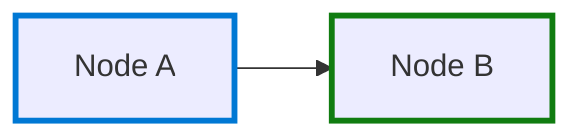
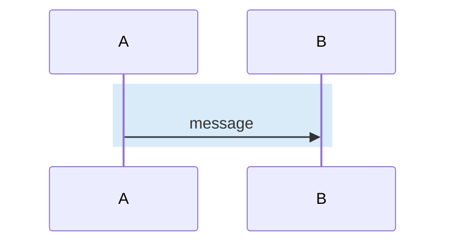
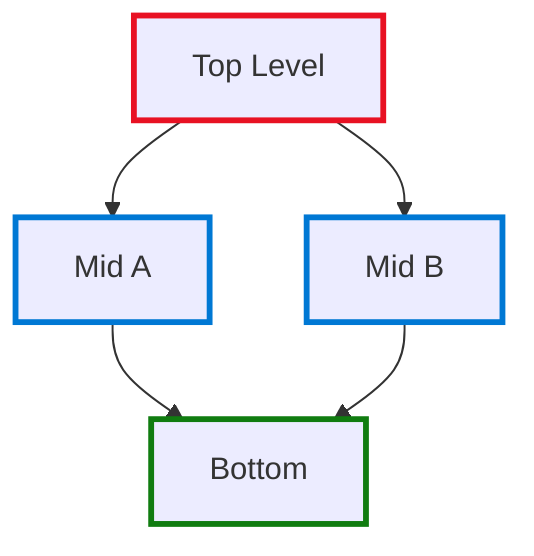
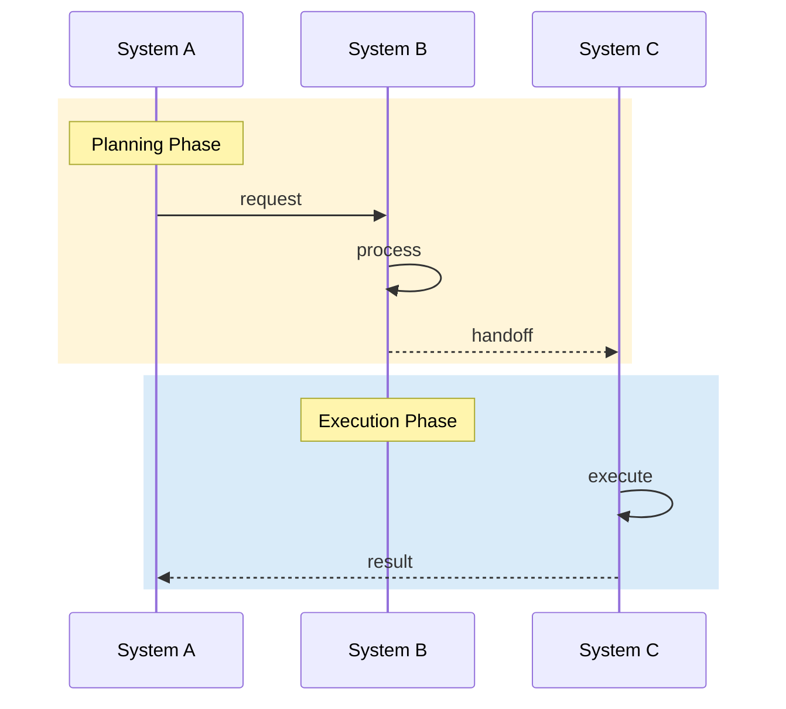
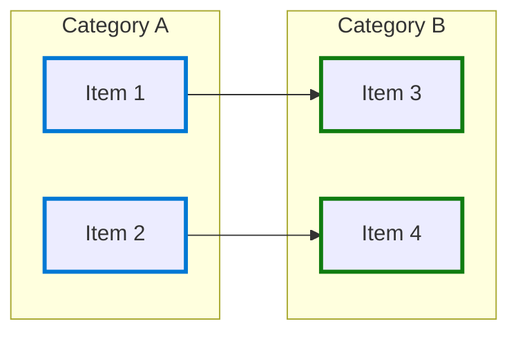

# FigJam Diagrams — Professional Mermaid Diagrams Skill

## Overview

This skill creates professional FigJam diagrams via the `Figma:generate_diagram` tool using Mermaid syntax with Microsoft brand aesthetics. It encodes critical rendering fixes and proven patterns.

## CRITICAL: Rendering Rules

### ⚠️ Rule 1: NEVER Use `classDef` with `fill` for Node Backgrounds

FigJam's Mermaid renderer **does NOT reliably support** `classDef` with `fill:#fff`. Nodes may render completely empty/invisible.

**BAD — May render empty:**
```mermaid
classDef plan fill:#fff,stroke:#FFB900,stroke-width:3px,color:#323130
PO["PO creates Epic"]:::plan
```

**GOOD — Always renders correctly:**
```mermaid
PO["PO creates Epic"]
style PO stroke:#FFB900,stroke-width:3px
```

### ✅ Rule 2: Use Individual `style` Declarations Per Node

Always apply styles individually AFTER all nodes and edges are declared:



### ✅ Rule 3: `classDef` IS Safe for Sequence Diagrams

Sequence diagrams use `rect rgba()` for color bands — this renders perfectly:



### ✅ Rule 4: `classDef` with `stroke-only` MAY Work

If you must use classDef, **omit fill entirely** and only set stroke:

```mermaid
classDef blue stroke:#0078D4,stroke-width:3px
```

But prefer individual `style` declarations for maximum reliability.

---

## Microsoft Brand Color Palette

### Primary Colors (use for node strokes)

| Color Name | Hex | RGB | Use For |
|-----------|-----|-----|---------|
| **Blue** | `#0078D4` | `0,120,212` | Code, Development, Primary actions |
| **Yellow/Gold** | `#FFB900` | `255,185,0` | Planning, Warnings, Events |
| **Green** | `#107C10` | `16,124,16` | Testing, Success, Approved |
| **Red** | `#E81123` | `232,17,35` | Security, Critical, Blocked |
| **Teal** | `#008272` | `0,130,114` | Monitoring, Observability, Infrastructure |
| **Purple** | `#5C2D91` | `92,45,145` | Agents, AI, Modernization |
| **Orange** | `#D83B01` | `216,59,1` | Human actions, Manual steps, ChatOps |

### Neutral Colors

| Color Name | Hex | Use For |
|-----------|-----|---------|
| **Text** | `#323130` | Node text color |
| **Light BG** | `#F3F2F1` | Legend backgrounds |
| **Border** | `#D2D0CE` | Legend borders |
| **Subtle** | `#605E5C` | Muted text |

### SDLC Phase Color Mapping

| Phase | Color | Hex | Agents |
|-------|-------|-----|--------|
| **PLAN** | Yellow | `#FFB900` | Aurora |
| **CODE** | Blue | `#0078D4` | Ary, Dev+Copilot |
| **TEST** | Green | `#107C10` | Íris |
| **SECURE** | Red | `#E81123` | Operação |
| **MONITOR** | Teal | `#008272` | Sabiá |
| **MODERNIZE** | Purple | `#5C2D91` | Águia |
| **HUMAN** | Orange | `#D83B01` | Manual merge, Deploy |

---

## Diagram Templates

### Template 1: Flowchart (LR — Left to Right)


### Template 2: Flowchart (TB — Top to Bottom)

Use for hierarchy, deployment levels, or organizational structures.



### Template 3: Sequence Diagram with Color Bands

Use `rect rgba(R,G,B,0.15)` for light color bands per phase — 15% opacity is the sweet spot.



### Template 4: Subgraph-Based (Groups/Categories)



---

## Tool Call Pattern

Always use the `Figma:generate_diagram` tool:

```json
{
  "mermaidSyntax": "",
  "userIntent": ""
}
```

### userIntent Best Practices

Write descriptive intents that help Figma render context:

- ✅ "SDLC end-to-end flow with Microsoft brand colors showing 6 AI agents in the pipeline"
- ✅ "Sequence diagram with transparent color bands per phase at 15% opacity"
- ✅ "Deployment hierarchy showing enterprise vs organization level agents"
- ❌ "diagram"
- ❌ "flow"

---

## Petrobras Agent Ecosystem Reference

For Petrobras-specific diagrams, use these agent configurations:

### Agent Registry

| Agent | Emoji | Color | Domain | MCP Servers |
|-------|-------|-------|--------|-------------|
| **Aurora** | 🌅 | Yellow `#FFB900` | Planning & Stories | github_api, backstage_mcp |
| **Ary** | 🏷️ | Blue `#0078D4` | Classification & Triage | github_api, backstage_mcp, terraform_mcp |
| **Íris** | 🧪 | Green `#107C10` | Test Automation (MVP) | github_api, ci_coverage_mcp, coding_agent |
| **Operação** | ⚙️ | Red `#E81123` | Security Automation | github_api, vault_mcp, observability_mcp |
| **Sabiá** | 🐦 | Teal `#008272` | Pipeline Diagnostics | backstage_mcp, observability_mcp, github_api |
| **Águia** | 🦅 | Purple `#5C2D91` | Modernization | github_api, backstage_mcp, terraform_mcp, coding_agent |

### Handoff Map (Inter-Agent Communication)

```
Aurora → Ary      (story classification)
Aurora → Íris     (test planning from stories)
Ary → Íris        (architectural context for tests)
Ary → Operação    (security issues flagged)
Ary → Águia       (modernization classification)
Íris → Operação   (security test failures)
Íris → Sabiá      (test execution feedback)
Operação → Sabiá  (pipeline security monitoring)
Águia → Íris      (regression tests for migrations)
Águia → Operação  (security baseline for new stack)
Sabiá → Íris      (test-failure diagnosis)
Sabiá → Operação  (security-block diagnosis)
Sabiá → Ary       (service routing)
```

### Trigger Map

| Agent | Slash Commands | GitHub Events |
|-------|---------------|---------------|
| Aurora | `/aurora`, `/decompose` | issues labeled "epic" |
| Ary | `/ary`, `/classify`, `/triage` | issues.opened, PR.opened |
| Íris | `/iris`, `/test-plan`, `/coverage` | PR.opened, PR.synchronize |
| Operação | `/security-scan`, `/operacao` | code_scanning, secret_scanning, dependabot, schedule |
| Sabiá | `/sabia`, `/diagnose` | workflow_run (failure) |
| Águia | `/aguia`, `/modernize` | issues labeled "modernization" |

---

## Common Diagram Recipes

### Recipe: Agent Individual Flow
For a single agent's internal flow (triggers → processing → outputs):

```
flowchart LR + subgraphs for TRIGGERS, PROCESSING, OUTPUTS
Use agent's assigned color for processing nodes
Use Yellow for trigger nodes
Use Green for output nodes
```

### Recipe: Multi-Agent Handoff
For showing handoffs between agents:

```
sequenceDiagram with rect rgba() bands
Each agent gets its own participant
Color bands match agent colors at 15% opacity
```

### Recipe: Requirements Matrix
For showing RF/RNF (functional/non-functional requirements):

```
flowchart TB with subgraphs
FUNCTIONAL subgraph with Green strokes
NON-FUNCTIONAL subgraph with Blue strokes
DEPENDENCIES shown as dashed arrows
```

### Recipe: Evolution Timeline
For skill → agent → autonomous progression:

```
flowchart LR with 3 phase nodes
Phase 1 (Skill) = Blue
Phase 2 (Agent) = Purple  
Phase 3 (Autonomous) = Teal
Connected with -->|"graduate"| edges
```

---

## Checklist Before Generating

1. ☐ Using individual `style` per node (NOT `classDef` with `fill`)
2. ☐ Microsoft brand colors applied correctly
3. ☐ Node text in double quotes: `["Node Label"]`
4. ☐ Edge labels in double quotes: `-->|"label"|`
5. ☐ Subgraph titles in double quotes: `subgraph ID["Title"]`
6. ☐ No special characters in node IDs (use alphanumeric only)
7. ☐ `userIntent` is descriptive (not generic)
8. ☐ For sequence diagrams: `rect rgba()` with 15% opacity
9. ☐ Styles declared AFTER all nodes and edges
10. ☐ `flowchart` keyword (not `graph`) for best compatibility