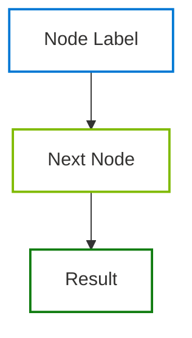

# Visual Assets Skill

Create professional, bilingual visual assets — SVG diagrams, PNG exports, and Mermaid source files — with Microsoft branding, educational legends, and consistent versioning.

## 1. Output Formats and Locations

| Format | Extension | Location | When to Use |
|--------|-----------|----------|-------------|
| **SVG** (preferred) | `.svg` | `output/images/svg/` | All diagrams — ALWAYS as separate files, referenced in Markdown |
| **PNG** | `.png` | `output/images/png/` | Screenshots, renders, exports where SVG is not possible |
| **Mermaid** | `.mmd` | `output/images/mermaid/` | Standalone source for FigJam via MCP connector — NEVER inline in Markdown |
| **Archive** | Mixed | `output/images/archive/` | Previous versions of any format |

### Critical Rule: Images are ALWAYS Separate Files

- **NEVER embed SVG code inline** inside Markdown documents. SVGs are saved as standalone `.svg` files in `output/images/svg/` and referenced in Markdown via image syntax:

```markdown

```

- **NEVER use ```mermaid code blocks** inside Markdown documents. Mermaid sources are saved as standalone `.mmd` files in `output/images/mermaid/`. The rendered SVG version is what gets referenced in the Markdown.
- The Markdown document contains only the **image reference** (``) plus a **descriptive paragraph** above it — never raw SVG/Mermaid code.

## 2. Naming Convention

Same pattern as all workspace deliverables:

```
NN_Title_vX.Y.Z_YYYY-MM-DD.<ext>
```

Examples:
- `03_Architecture_Overview_v1.0.0_2026-03-19.svg`
- `03_Architecture_Overview_v1.0.0_2026-03-19.png`
- `19_Multi_Agent_Handoff_Map_v1.0.0_2026-03-19.mmd`

**Versioning:** Semantic versioning (major.minor.patch). Move previous version to `output/images/archive/` before overwriting.

## 3. Bilingual Support (EN + PT-BR)

Every visual asset MUST be produced in **two versions**:

| Version | Suffix | Example |
|---------|--------|---------|
| English | `_EN` | `03_Architecture_Overview_EN_v1.0.0_2026-03-19.svg` |
| Portuguese | `_PTBR` | `03_Architecture_Overview_PTBR_v1.0.0_2026-03-19.svg` |

**Rules:**
- All labels, titles, legends, and annotations must be translated.
- Technical terms that have no standard translation stay in English in both versions (e.g., "MCP", "API", "DevOps", "pipeline", "deploy").
- The EN version is the canonical source; the PT-BR version is derived from it.
- Both versions follow identical visual layout — only text changes.

## 4. Microsoft Branding — Color Rules

### All Formats (SVG, PNG, Mermaid)

| Element | Color | Hex | Usage |
|---------|-------|-----|-------|
| **Border / Stroke** | Microsoft Blue | `#0078D4` | Primary borders, main flow lines |
| **Border / Stroke** | Microsoft Red | `#F25022` | Alert nodes, error paths |
| **Border / Stroke** | Microsoft Green | `#7FBA00` | Success nodes, result paths |
| **Border / Stroke** | Microsoft Yellow | `#FFB900` | Warning nodes, caution paths |
| **Fill** | White | `#FFFFFF` | **Always white** — all shapes, nodes, containers |
| **Text** | Dark Gray | `#323130` | **Always black** — all labels, titles, content |
| **Connectors** | Secondary Gray | `#605E5C` | Arrows, lines between nodes |
| **Subgraph borders** | Light Gray | `#F3F2F1` | Dashed borders for grouped elements |
| **Background** | Transparent | — | No background fill |

### Extended Colors (when 4 primary colors are not enough)

| Color | Hex | Usage |
|-------|-----|-------|
| Extended Green | `#107C10` | Success states, completed items |
| Extended Red | `#E81123` | Error states, blocked items |
| Teal | `#008272` | MCP/integration nodes |
| Purple | `#5C2D91` | AI/model nodes |
| Orange | `#D83B01` | Warning states |

### What NOT to Do

- **NEVER** use colored fills inside shapes — fill is always white
- **NEVER** use random hex colors outside the Microsoft palette
- **NEVER** use gradients or shadows
- **NEVER** use text colors other than `#323130`
- **NEVER** use borders thicker than 3px
- **NEVER** embed SVG code inline in Markdown — always save as separate file
- **NEVER** use ```mermaid blocks in Markdown — save as `.mmd` file, reference the SVG render

## 5. Professional Editorial Layout (MANDATORY)

Every diagram must look like it was designed by a professional editorial designer for a published report. **No amateur layouts.**

### Spacing and Grid

- **Minimum 60px** between nodes (horizontally and vertically)
- **Align nodes on a consistent grid** — never random positions
- **Consistent node sizes** within the same diagram (same width/height for nodes of the same type)
- **Professional margins:** minimum 20px padding on all edges of the SVG
- **viewBox dimensions** must be calculated based on actual content — never hardcoded to a generic size

### Text Handling

- **Text must NEVER overflow** its container — if text is too long:
  - Use `<tspan>` for multi-line text within a node
  - Or truncate with ellipsis and add full text in the legend
- **Font sizes:** 16px for titles, 13px for node labels, 11px for annotations/legend
- **Line height:** minimum 18px between text lines within a node

### Connector Routing

- **Lines must NEVER cross through other nodes** — route around them
- **Use orthogonal routing** (horizontal/vertical lines with 90° turns) — never diagonal unless it's the only path
- **Arrowheads must be visible** — not hidden behind the target node
- **Label connector lines** when the relationship is not obvious (e.g., "webhook", "HTTPS", "async")

### Grouping and Subgraphs

- **Subgraph labels** must be **above or outside** the group border — never overlapping content inside
- **Dashed border** with 8px padding inside the subgraph
- **Group related nodes** — maximum 5-6 nodes per subgraph

### Complexity Control

- **Maximum 15 nodes** per diagram — if more complex, split into multiple diagrams
- **Maximum 3 levels** of nesting (subgraph inside subgraph)
- **Number sequential steps** (1, 2, 3...) on connectors or in node labels
- **Flow direction:** Always top-to-bottom (TB) or left-to-right (LR) — never mix

### Visual Hierarchy

- **Primary flow** uses thicker connectors (2px) and Microsoft blue (#0078D4)
- **Secondary/optional paths** use thinner connectors (1px) and dashed lines
- **Decision diamonds** centered on the main flow axis
- **Result/output nodes** at the bottom or right edge of the diagram

## 6. SVG Specifications

```xml
<svg viewBox="0 0 [width] [height]" width="100%" xmlns="http://www.w3.org/2000/svg">
  <!-- Arrowhead marker -->
  <defs>
    <marker id="arrow" viewBox="0 0 10 6" refX="10" refY="3"
      markerWidth="10" markerHeight="6" orient="auto-start-reverse">
      <path d="M 0 0 L 10 3 L 0 6 z" fill="#605E5C"/>
    </marker>
  </defs>

  <!-- Node example -->
  <rect x="10" y="10" width="160" height="40" rx="6"
    fill="#FFFFFF" stroke="#0078D4" stroke-width="2"/>
  <text x="90" y="35" text-anchor="middle"
    font-family="Segoe UI, sans-serif" font-size="13" fill="#323130">
    Label Text
  </text>

  <!-- Connector example -->
  <line x1="170" y1="30" x2="250" y2="30"
    stroke="#605E5C" stroke-width="1.5" marker-end="url(#arrow)"/>
</svg>
```

**SVG Rules:**
- `viewBox` + `width="100%"` for responsive rendering
- `rx="6"` for rounded corners on rectangles
- `font-family="Segoe UI, sans-serif"` for all text
- `font-size="13"` for node labels, `font-size="11"` for annotations
- `font-size="16"` and `font-weight="600"` for titles
- Adequate spacing: minimum 40px between nodes
- All tags properly closed (well-formed XML)

## 6. Mermaid Specifications

For standalone `.mmd` files (used with FigJam via MCP):



**Mermaid Rules:**
- Use `style` declarations (not `classDef` with `fill` — FigJam rendering issue)
- Place `style` declarations **after** all nodes and edges
- Fill always `#FFFFFF`, text always `color:#323130`
- Microsoft colors on `stroke` only
- `userIntent` for FigJam must be descriptive (>20 chars)

## 7. PNG Specifications

- **Resolution:** Minimum 2x (retina) — 300 DPI for print, 144 DPI for screen
- **Background:** White (`#FFFFFF`) or transparent
- **Max dimensions:** 1920x1080px for full diagrams, 800x600px for component details
- **Compression:** Optimize file size without losing quality
- **Naming:** Same convention with `_EN` / `_PTBR` suffix

## 8. Legends and Annotations (Mandatory)

### Every diagram MUST include:

1. **Title** — Bold, centered or top-left, `font-size="16"`
2. **Descriptive paragraph** — Above the diagram in Markdown explaining what it shows, why it matters, and how to read it
3. **Legend** — Bottom or right side explaining:
   - Color meanings (which Microsoft color represents what)
   - Shape meanings (rectangles = services, rounded = processes, diamonds = decisions)
   - Line styles (solid = data flow, dashed = optional/async)
   - Any acronyms, abbreviations, or technical terms used

### Legend Template (SVG)

```xml
<!-- Legend box -->
<rect x="10" y="[bottom]" width="300" height="120" rx="4"
  fill="#F3F2F1" stroke="#E1DFDD" stroke-width="1"/>
<text x="20" y="[bottom+20]" font-family="Segoe UI, sans-serif"
  font-size="12" font-weight="600" fill="#323130">Legend</text>

<!-- Legend items -->
<rect x="20" y="[y]" width="12" height="12" fill="#FFFFFF" stroke="#0078D4" stroke-width="2"/>
<text x="38" y="[y+10]" font-size="11" fill="#323130">Azure Services</text>

<rect x="20" y="[y+20]" width="12" height="12" fill="#FFFFFF" stroke="#F25022" stroke-width="2"/>
<text x="38" y="[y+30]" font-size="11" fill="#323130">AWS Services</text>

<rect x="20" y="[y+40]" width="12" height="12" fill="#FFFFFF" stroke="#7FBA00" stroke-width="2"/>
<text x="38" y="[y+50]" font-size="11" fill="#323130">GitHub Services</text>
```

### Acronym/Term Glossary

If the diagram uses acronyms, codes, or domain-specific terms, add a glossary table either:
- Inside the SVG as a legend section, OR
- Below the diagram in the Markdown as a table:

```markdown
| Term | Meaning |
|------|---------|
| MCP | Model Context Protocol — universal tool integration layer |
| ADR | Architecture Decision Record |
| MTTR | Mean Time to Recovery |
```

## 9. Didactic and Educational Style

Every visual asset must be **self-explanatory** to someone seeing it for the first time:

- **Flow direction:** Always top-to-bottom (TB) or left-to-right (LR). Never mix directions.
- **Complexity limit:** Maximum 15 nodes per diagram. Split into multiple diagrams if more.
- **Grouping:** Use subgraphs/containers with dashed borders to group related components.
- **Numbering:** Number sequential steps (1, 2, 3...) on connector lines or in node labels.
- **Annotations:** Add brief explanatory notes near complex interactions.
- **Before/After:** When showing transformations, use clear visual separation.
- **Color consistency:** Same entity always gets the same color across all diagrams in the project.

## 10. Quality Checklist

Before delivering any visual asset, verify:

- [ ] **Format:** SVG preferred. PNG only when SVG not possible. Mermaid only for FigJam.
- [ ] **Bilingual:** Both EN and PT-BR versions exist
- [ ] **Naming:** Follows `NN_Title_{EN|PTBR}_vX.Y.Z_YYYY-MM-DD.<ext>`
- [ ] **Colors:** White fill, black text, Microsoft colors on borders ONLY
- [ ] **No colored fills** — shapes are always white inside
- [ ] **Legend present** — explains colors, shapes, line styles
- [ ] **Acronym glossary** — all terms defined (in legend or Markdown table below)
- [ ] **Descriptive paragraph** — above the diagram in Markdown
- [ ] **Title** — inside the diagram or as Markdown heading
- [ ] **Responsive:** SVG has `viewBox` + `width="100%"`
- [ ] **Max 15 nodes** — split if more complex
- [ ] **Flow direction** — consistent TB or LR
- [ ] **Standalone copy** — saved in `output/images/svg/` (not only inline)
- [ ] **Archived** — previous version moved to `output/images/archive/`
- [ ] **Well-formed XML** — all SVG tags properly closed
- [ ] **Factual integrity** — no fabricated data in labels or annotations
