# Foundry Prototype Generator

[](https://github.com/company/foundry-prototype-generator/actions/workflows/ci.yml)

> Automated platform that transforms business requirements into fully functional, shareable web application prototypes in under 5 minutes — powered by a multi-agent pipeline (Foundry), Model Context Protocol (MCP), GitHub, and ephemeral Azure Container Apps environments.

## Overview

A business user fills out a web form describing the prototype they need. The system orchestrates five specialized AI agents that parse requirements, select design system components, generate React + Vue code, write documentation, and publish everything to a GitHub repository with a live, shareable URL on Azure Container Apps.

```mermaid
graph LR
    A[Web Form] --> B[Foundry Orchestrator]
    B --> C[Agent 1: Parse]
    C --> D[Agent 2: Components]
    D --> E[Agent 3: Code Gen]
    E --> F[Agent 4: Docs]
    F --> G[Agent 5: Publish + Deploy]
    G --> H[GitHub Repo]
    H --> I[ACR]
    I --> J[Azure Container Apps]
    J --> K[Shareable URL]
```



Each prototype gets a **unique URL** that auto-expires after a configurable TTL (default: 72 hours), similar to CodeSandbox deployments.

**Full specification:** [Architecture Document](sdd/Foundry_Prototype_Generator_Architecture_v1.0.0_2026-04-09.md)

---

## Table of Contents

- [Project Structure](#project-structure)
- [Prerequisites](#prerequisites)
- [Getting Started](#getting-started)
- [Available Scripts](#available-scripts)
- [Architecture](#architecture)
- [Technology Stack](#technology-stack)
- [Infrastructure](#infrastructure)
- [Contributing](#contributing)
- [License](#license)

---

## Project Structure

```
foundry-prototype-generator/
├── apps/
│   ├── web-form/                  # React + Vite + TypeScript — user-facing form
│   └── cleanup-function/          # Azure Functions (Python) — TTL cleanup
├── mcp-server-design-system/      # MCP server (TypeScript) — design system gateway
├── foundry-agents/
│   ├── agents/                    # 5 agent configs + system prompts
│   ├── workflows/                 # Foundry orchestration workflow
│   └── test-fixtures/             # Sample form inputs for testing
├── templates/                     # Per-prototype generated files
│   ├── Dockerfile                 # Multi-stage: Node build → nginx
│   ├── nginx.conf                 # SPA routing + security headers
│   ├── landing-page/              # Framework selector page
│   └── github-actions/            # CI/CD workflow template
├── infra/                         # Azure infrastructure (Bicep)
│   ├── main.bicep                 # ACR, ACA Environment, Functions, Identity
│   ├── modules/                   # Bicep modules
│   ├── parameters/                # Environment-specific params
│   └── scripts/                   # Provisioning scripts
├── .github/workflows/             # CI + infra deployment
├── package.json                   # npm workspaces root
└── .env.example                   # All environment variables
```

---

## Prerequisites

| Tool | Version | Purpose |
|------|---------|---------|
| [Node.js](https://nodejs.org/) | >= 20 | Web form, MCP server |
| [Python](https://www.python.org/) | >= 3.11 | Cleanup function |
| [Azure CLI](https://learn.microsoft.com/en-us/cli/azure/) | Latest | Infrastructure provisioning |
| [GitHub CLI](https://cli.github.com/) | Latest | Repository management |
| [Docker](https://www.docker.com/) | Latest | Local container testing (optional) |

---

## Getting Started

### 1. Clone and install

```bash
git clone https://github.com/company/foundry-prototype-generator.git
cd foundry-prototype-generator
npm install
```

### 2. Configure environment

```bash
cp .env.example .env
# Edit .env with your Foundry API URL, tokens, and Azure credentials
```

### 3. Run locally

```bash
# Start the web form (http://localhost:5173)
npm run dev:form

# Start MCP server in watch mode
npm run dev:mcp
```

### 4. Provision Azure infrastructure (one-time)

```bash
cd infra
chmod +x scripts/*.sh
./scripts/provision.sh dev
./scripts/setup-oidc.sh
```

See [infra/scripts/setup-oidc.sh](infra/scripts/setup-oidc.sh) for the full list of GitHub secrets to configure.

---

## Available Scripts

Run from the repository root:

| Script | Description |
|--------|-------------|
| `npm run dev:form` | Start web form dev server (port 5173) |
| `npm run dev:mcp` | Start MCP server in watch mode |
| `npm run build:form` | Production build of the web form |
| `npm run build:mcp` | Compile MCP server TypeScript |
| `npm run lint` | Lint all workspaces |
| `npm run test` | Run tests across all workspaces |
| `npm run clean` | Remove all `node_modules` directories |

---

## Architecture

### Pipeline

The system executes a five-agent sequential pipeline:

| Step | Agent | Timeout | MCP Access | Output |
|------|-------|---------|------------|--------|
| 1 | Requirements Parser | 30s | No | Structured specification |
| 2 | Component Selector | 60s | Yes | Selected components + code |
| 3 | Code Generator | 120s | Yes | Complete React + Vue projects |
| 4 | Documentation Writer | 60s | No | README, Architecture, Components, Deployment |
| 5 | GitHub Publisher + Azure Deployer | 120s | No | Repository + live URL |

### Ephemeral Environments

Each generated prototype is deployed as an Azure Container App:

- **Image:** nginx serving static React + Vue builds
- **Scale:** 0–1 replicas (scale-to-zero when idle)
- **Cost:** ~$0/hour idle, ~$0.01/hour active
- **TTL:** Configurable (24h, 72h, 7d, 30d) — auto-deleted by cleanup function
- **URL:** `https://{name}-{hash}.{env}.{region}.azurecontainerapps.io`

### MCP Server

The MCP Design System server exposes six tools to the agents:

| Tool | Description |
|------|-------------|
| `list_components` | List all available design system components |
| `get_component_code` | Return example code for a specific component |
| `get_component_props` | Return TypeScript interface/props |
| `search_components` | Search components by description or use-case |
| `get_design_tokens` | Return design tokens (colors, spacing, typography) |
| `get_component_examples` | Return complete usage examples from Storybook |

---

## Technology Stack

| Layer | Technology | Role |
|-------|-----------|------|
| Frontend | React 19, Vite 6, TypeScript | Prototype request form |
| Orchestration | Foundry | Multi-agent pipeline coordination |
| Design System Gateway | MCP SDK (TypeScript) | Expose components to agents via tools |
| Version Control | GitHub API + Actions | Repository creation, CI/CD |
| Container Registry | Azure Container Registry | Docker image storage |
| Ephemeral Hosting | Azure Container Apps | Scale-to-zero, FQDN per prototype |
| Lifecycle Management | Azure Functions (Python) | Timer-triggered TTL cleanup |
| Infrastructure | Bicep | ACR, ACA Environment, Functions, Identity |
| Static Serving | nginx | SPA routing, security headers, gzip |

---

## Infrastructure

### Azure Resources (one-time setup)

| Resource | SKU | Purpose |
|----------|-----|---------|
| Azure Container Registry | Basic | Store prototype Docker images |
| Azure Container Apps Environment | Consumption | Host ephemeral prototype apps |
| Azure Functions | Consumption (Python 3.11) | Hourly TTL cleanup |
| Managed Identity | — | OIDC federation for GitHub Actions |
| Log Analytics Workspace | PerGB2018 | Centralized logging |

### Deployment Flow (per prototype)

```
GitHub Actions → Docker build → ACR push → az containerapp create → FQDN live
```

All infrastructure is defined in [infra/main.bicep](infra/main.bicep) with modular components.

---

## Contributing

1. Create a feature branch from `main`
2. Make changes following existing patterns
3. Ensure `npm run lint` and `npm run build:mcp && npm run build:form` pass
4. Open a pull request

### Key Conventions

- TypeScript for all Node.js code
- Agent prompts in Markdown (`system-prompt.md`)
- Agent configs in YAML (`config.yaml`)
- Infrastructure in Bicep (modular, parameterized)
- Secrets never committed — use `.env.example` as reference

---

## License

Internal use — Company Name © 2026. All rights reserved.
