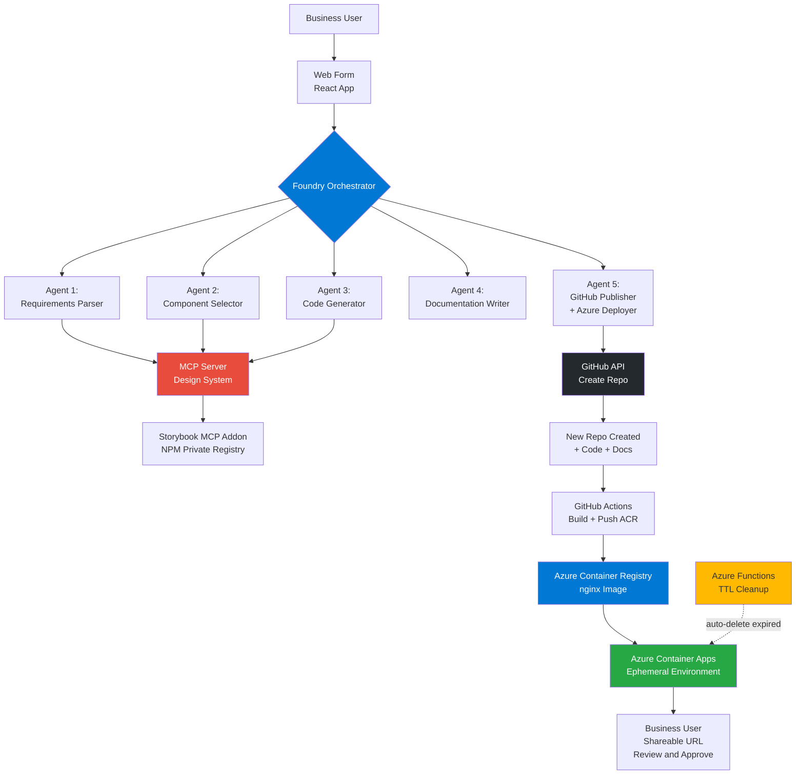
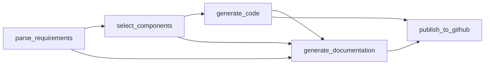

# Foundry Prototype Generator - Architecture Document

> Automated system that enables business users to create functional web application prototypes through a simple form, leveraging Foundry Agents, Model Context Protocol (MCP), and GitHub for end-to-end code generation, versioning, and deployment.

## Change Log

| Version | Date       | Author      | Changes                                      |
|---------|------------|-------------|----------------------------------------------|
| 1.0.0   | 2026-04-09 | Paula Silva | Initial architecture document                |
| 1.1.0   | 2026-04-09 | Paula Silva | Replace GitHub Pages with Azure Container Apps ephemeral environments |

## Table of Contents

- [Foundry Prototype Generator - Architecture Document](#foundry-prototype-generator---architecture-document)
  - [Change Log](#change-log)
  - [Table of Contents](#table-of-contents)
  - [1. Introduction](#1-introduction)
    - [1.1 Purpose](#11-purpose)
    - [1.2 Scope](#12-scope)
    - [1.3 Validated Technologies](#13-validated-technologies)
  - [2. Architecture Overview](#2-architecture-overview)
    - [2.1 High-Level Architecture](#21-high-level-architecture)
    - [2.2 Component Map](#22-component-map)
    - [2.3 End-to-End Pipeline](#23-end-to-end-pipeline)
  - [3. Components](#3-components)
    - [3.1 Web Form (Frontend)](#31-web-form-frontend)
    - [3.2 Foundry Orchestrator](#32-foundry-orchestrator)
    - [3.3 Foundry Agents](#33-foundry-agents)
    - [3.4 MCP Server - Design System](#34-mcp-server---design-system)
    - [3.5 GitHub Integration](#35-github-integration)
    - [3.6 Azure Ephemeral Environments](#36-azure-ephemeral-environments)
  - [4. Data Flow and Contracts](#4-data-flow-and-contracts)
    - [4.1 Form Submission Payload](#41-form-submission-payload)
    - [4.2 Agent Inter-Communication](#42-agent-inter-communication)
    - [4.3 MCP Tool Definitions](#43-mcp-tool-definitions)
    - [4.4 Output Artifacts](#44-output-artifacts)
  - [5. Agent Specifications](#5-agent-specifications)
    - [5.1 Agent 1: Requirements Parser](#51-agent-1-requirements-parser)
    - [5.2 Agent 2: Component Selector](#52-agent-2-component-selector)
    - [5.3 Agent 3: Code Generator](#53-agent-3-code-generator)
    - [5.4 Agent 4: Documentation Writer](#54-agent-4-documentation-writer)
    - [5.5 Agent 5: GitHub Publisher + Azure Deployer](#55-agent-5-github-publisher--azure-deployer)
  - [6. MCP Server Implementation](#6-mcp-server-implementation)
    - [6.1 Server Configuration](#61-server-configuration)
    - [6.2 Tool Handlers](#62-tool-handlers)
    - [6.3 Helper Functions](#63-helper-functions)
    - [6.4 Package Configuration](#64-package-configuration)
  - [7. Foundry Workflow Configuration](#7-foundry-workflow-configuration)
    - [7.1 Workflow Definition](#71-workflow-definition)
    - [7.2 Step Dependencies](#72-step-dependencies)
  - [8. CI/CD Pipeline](#8-cicd-pipeline)
    - [8.1 GitHub Actions Workflow](#81-github-actions-workflow)
    - [8.2 Landing Page Generation](#82-landing-page-generation)
  - [9. Generated Output Structure](#9-generated-output-structure)
    - [9.1 Repository Layout](#91-repository-layout)
    - [9.2 Execution Timeline](#92-execution-timeline)
    - [9.3 Generated URLs](#93-generated-urls)
  - [10. Implementation Plan](#10-implementation-plan)
    - [10.1 Week 1: Infrastructure and Core](#101-week-1-infrastructure-and-core)
    - [10.2 Week 2: Frontend and Testing](#102-week-2-frontend-and-testing)
  - [11. Architecture Decisions](#11-architecture-decisions)
    - [11.1 ADR-001: Multi-Agent Pipeline over Monolithic Generator](#111-adr-001-multi-agent-pipeline-over-monolithic-generator)
    - [11.2 ADR-002: MCP for Design System Access](#112-adr-002-mcp-for-design-system-access)
    - [11.3 ADR-003: Dual Framework Support (React + Vue)](#113-adr-003-dual-framework-support-react--vue)
    - [11.4 ADR-004: Azure Container Apps for Ephemeral Prototype Hosting](#114-adr-004-azure-container-apps-for-ephemeral-prototype-hosting)
    - [11.5 ADR-005: TTL-based Ephemeral Lifecycle Management](#115-adr-005-ttl-based-ephemeral-lifecycle-management)
  - [12. Non-Functional Requirements](#12-non-functional-requirements)
    - [12.1 Performance](#121-performance)
    - [12.2 Security](#122-security)
    - [12.3 Scalability](#123-scalability)
    - [12.4 Observability](#124-observability)
  - [13. Future Roadmap](#13-future-roadmap)
  - [14. Support and Contact](#14-support-and-contact)
  - [References](#references)

---

## 1. Introduction

### 1.1 Purpose

The **Foundry Prototype Generator** is an automated system that transforms business requirements captured through a web form into fully functional web application prototypes. The system eliminates the need for manual coding during the ideation and MVP validation phase, reducing prototype delivery time from weeks to approximately five minutes.

This document provides a complete architectural specification covering system components, data flows, agent configurations, integration points, and implementation guidance for the engineering team.

### 1.2 Scope

The system covers the following capabilities:

- A web-based input form for capturing project requirements, component selections, and configuration preferences.
- A multi-agent orchestration layer running on **Foundry** that parses requirements, selects design system components, generates code, writes documentation, and publishes to GitHub.
- A **Model Context Protocol (MCP)** server that exposes corporate design system components (React and Vue) to the Foundry agents.
- Automated repository creation, CI/CD configuration, and **ephemeral deployment to Azure Container Apps** with shareable URLs and configurable TTL.
- Documentation generation including README, architecture docs, component guides, and deployment instructions.

### 1.3 Validated Technologies

The architecture relies on the following technology integrations, each validated for production readiness:

| Technology                  | Validation Status                                |
|-----------------------------|--------------------------------------------------|
| Storybook MCP Addon         | Official addon available since 2025              |
| Microsoft Foundry + GitHub Actions | Native automation support confirmed        |
| Palantir Foundry + GitHub   | Native connector available                       |
| MCP with private NPM        | Officially supported                             |
| Design systems via MCP      | Documented practice with growing adoption        |
| Azure Container Apps        | GA since 2022, revision-based deployments, scale-to-zero, FQDN auto-generated. [Docs](https://learn.microsoft.com/en-us/azure/container-apps/overview) |
| Azure Container Registry    | Integrated with ACA for private image hosting. [Docs](https://learn.microsoft.com/en-us/azure/container-registry/container-registry-intro) |
| Azure Functions (Timer)     | Serverless scheduled execution for TTL cleanup. [Docs](https://learn.microsoft.com/en-us/azure/azure-functions/functions-bindings-timer) |

---

## 2. Architecture Overview

### 2.1 High-Level Architecture

The system follows a **pipeline architecture** where a Foundry Orchestrator coordinates five specialized agents in sequence. Each agent receives the output of the previous stage and produces structured artifacts for the next. The MCP Server acts as a shared resource layer, providing design system data to agents that need component information.



### 2.2 Component Map

The system consists of four major subsystems:

| Subsystem              | Technology              | Responsibility                                           |
|------------------------|-------------------------|----------------------------------------------------------|
| Frontend               | React + Vite            | Capture user requirements through a structured form      |
| Orchestration Layer    | Foundry                 | Coordinate agent execution, manage state, handle errors  |
| Design System Gateway  | MCP Server (TS)         | Expose components, props, tokens, and examples to agents |
| Delivery Pipeline      | GitHub + Actions        | Repository creation, CI/CD, container image build        |
| Ephemeral Hosting      | Azure Container Apps    | Shareable URL generation, scale-to-zero, auto-expiration |
| Lifecycle Manager      | Azure Functions (Timer) | TTL enforcement, cleanup of expired prototypes           |

### 2.3 End-to-End Pipeline

The generation process executes as a sequential pipeline with defined timeouts at each stage:

1. **Business User** fills out the web form with project requirements.
2. **Foundry Orchestrator** receives the form data via API (`POST /api/generate-prototype`).
3. **Agent 1 (Requirements Parser)** analyzes and structures the raw form data into a formal specification (timeout: 30s).
4. **Agent 2 (Component Selector)** queries the MCP Server to find and select the best design system components (timeout: 60s).
5. **Agent 3 (Code Generator)** produces complete React and Vue project code using the selected components (timeout: 120s).
6. **Agent 4 (Documentation Writer)** generates README, ARCHITECTURE, COMPONENTS, and DEPLOYMENT docs (timeout: 60s).
7. **Agent 5 (GitHub Publisher + Azure Deployer)** creates the repository, pushes code, configures CI/CD, and triggers Azure deployment (timeout: 120s).
8. **GitHub Actions** builds both React and Vue projects, packages them into an nginx Docker image, and pushes to Azure Container Registry.
9. **Azure Container Apps** creates a new ephemeral container app with a unique FQDN URL.
10. **Business User** receives the shareable URL and validates the MVP. The environment auto-expires after the configured TTL (default: 72 hours).

Estimated total time from form submission to live prototype: **~4.5 minutes**.

---

## 3. Components

### 3.1 Web Form (Frontend)

The web form is a React application built with Vite and TypeScript. It captures all the information the agents need to generate a prototype.

**Form structure:**

```yaml
Informacoes Basicas:
  - Nome do Projeto: [text input]
  - Descricao: [textarea]
  - Framework: [React | Vue | Ambos]

Tipo de Prototipo:
  - Dashboard
  - Landing Page
  - CRUD/Form
  - E-commerce
  - Custom

Componentes Desejados:
  - [Multi-select integrado com Storybook]
  - Exemplos: DataTable, Chart, Form, Button, Card, etc.

Funcionalidades:
  - Autenticacao
  - Integracao com API REST
  - Design Responsivo
  - Dark Mode
  - Internacionalizacao (i18n)
  - Testes automatizados

Regras de Negocio:
  - [Textarea para descricao livre]

Configuracoes GitHub:
  - Nome do Repositorio: [auto-gerado ou custom]
  - Visibilidade: [Public | Private]
  - Colaboradores: [lista de usuarios GitHub]

Ambiente Efemero:
  - Tempo de Vida (TTL): [24h | 72h | 7 dias | 30 dias]
  - Regiao Azure: [East US 2 | West Europe | Southeast Asia]
  - Notificar antes de expirar: [Sim | Nao]
```

**Implementation (React + TypeScript):**

```typescript
// src/components/PrototypeForm.tsx

import { useState } from 'react';

interface FormData {
  projectName: string;
  description: string;
  framework: 'react' | 'vue' | 'both';
  prototypeType: string;
  components: string[];
  features: string[];
  businessRules: string;
  repoVisibility: 'public' | 'private';
  collaborators: string[];
  ttlHours: number;
  azureRegion: string;
}

export function PrototypeForm() {
  const [formData, setFormData] = useState<FormData>({
    projectName: '',
    description: '',
    framework: 'both',
    prototypeType: 'dashboard',
    components: [],
    features: [],
    businessRules: '',
    repoVisibility: 'private',
    collaborators: [],
    ttlHours: 72,
    azureRegion: 'eastus2'
  });

  const [isGenerating, setIsGenerating] = useState(false);
  const [result, setResult] = useState<{
    repoUrl?: string;
    prototypeUrl?: string;
    reactUrl?: string;
    vueUrl?: string;
    expiresAt?: string;
    error?: string;
  }>();

  const handleSubmit = async (e: React.FormEvent) => {
    e.preventDefault();
    setIsGenerating(true);

    try {
      const response = await fetch(
        process.env.FOUNDRY_API_URL + '/api/generate-prototype',
        {
          method: 'POST',
          headers: {
            'Content-Type': 'application/json',
            'Authorization': `Bearer ${process.env.FOUNDRY_API_TOKEN}`
          },
          body: JSON.stringify(formData)
        }
      );

      const data = await response.json();

      setResult({
        repoUrl: data.repository_url,
        prototypeUrl: data.prototype_url,
        reactUrl: data.react_url,
        vueUrl: data.vue_url,
        expiresAt: data.expires_at
      });
    } catch (error) {
      setResult({ error: error.message });
    } finally {
      setIsGenerating(false);
    }
  };

  return (
    <form onSubmit={handleSubmit}>
      {/* Form fields mapped to FormData interface */}

      {isGenerating && (
        <div className="loading">
          Generating prototype... This may take 2-3 minutes.
        </div>
      )}

      {result?.repoUrl && (
        <div className="success">
          Prototype created successfully!
          <br />
          Repository: <a href={result.repoUrl}>{result.repoUrl}</a>
          <br />
          Live Prototype: <a href={result.prototypeUrl}>{result.prototypeUrl}</a>
          <br />
          React: <a href={result.reactUrl}>{result.reactUrl}</a>
          <br />
          Vue: <a href={result.vueUrl}>{result.vueUrl}</a>
          <br />
          <small>Expires: {result.expiresAt}</small>
        </div>
      )}
    </form>
  );
}
```

**Dependencies:** `@tanstack/react-query`, `axios`, `zod`, `react-hook-form`.

### 3.2 Foundry Orchestrator

The orchestrator is the central coordination layer that receives form data via its API trigger, sequences agent execution, passes outputs between steps, and returns the final result to the frontend. It manages timeouts, error handling, and retry policies.

Key responsibilities: receiving the HTTP request, validating input schema, executing the five-agent pipeline in order, aggregating final outputs (repository URL, prototype URL, expiration time), and returning the response to the caller.

### 3.3 Foundry Agents

The system uses five specialized agents, each with a focused responsibility. All agents use GPT-4 as their underlying model. Agents 2 and 3 have access to the MCP Design System server for component queries. See [Section 5](#5-agent-specifications) for full specifications.

| Agent | Name                           | Model | Temperature | Timeout | MCP Access |
|-------|--------------------------------|-------|-------------|---------|------------|
| 1     | Requirements Parser            | GPT-4 | 0.2         | 30s     | No         |
| 2     | Component Selector             | GPT-4 | 0.3         | 60s     | Yes        |
| 3     | Code Generator                 | GPT-4 | 0.4         | 120s    | Yes        |
| 4     | Documentation Writer           | GPT-4 | 0.3         | 60s     | No         |
| 5     | GitHub Publisher + Azure Deployer | GPT-4 | 0.2      | 120s    | No         |

### 3.4 MCP Server - Design System

A TypeScript-based MCP server that exposes the corporate design system to Foundry agents. It connects to the Storybook instance and the private NPM registry to provide component metadata, code examples, props/interfaces, design tokens, and search capabilities. See [Section 6](#6-mcp-server-implementation) for the full implementation.

**Exposed tools:**

| Tool                    | Description                                       |
|-------------------------|---------------------------------------------------|
| `list_components`       | List all available design system components        |
| `get_component_code`    | Return example code for a specific component       |
| `get_component_props`   | Return the TypeScript interface/props              |
| `search_components`     | Search components by description or use-case       |
| `get_design_tokens`     | Return design tokens (colors, spacing, typography) |
| `get_component_examples`| Return complete usage examples from Storybook      |

### 3.5 GitHub Integration

The GitHub integration layer handles repository lifecycle management through the GitHub API. It creates repositories, commits generated code and documentation (including Dockerfile and nginx.conf), configures GitHub Actions workflows for building and deploying to Azure, adds collaborators, and sets up project labels.

### 3.6 Azure Ephemeral Environments

Each generated prototype is deployed as an ephemeral Azure Container App. The architecture uses three Azure resources:

**Azure Container Registry (ACR):** Stores the nginx-based Docker images containing the built React and Vue applications. One registry shared across all prototypes.

**Azure Container Apps Environment:** A shared environment that hosts all prototype container apps. Provides networking, logging, and the base domain for generated URLs.

**Azure Container Apps (per prototype):** Each prototype creates one container app with the following characteristics:

| Property | Value |
|---|---|
| Image | `{acr-name}.azurecr.io/prototypes/{project-name}:{git-sha}` |
| CPU / Memory | 0.25 vCPU / 0.5 Gi (minimum) |
| Scale | 0-1 replicas (scale-to-zero when idle) |
| Ingress | External, port 80, HTTPS auto-provisioned |
| TTL | Configurable (default: 72h), enforced by cleanup function |
| Tags | `ttl`, `created-at`, `project-name`, `created-by` |

**URL Pattern:**

```
https://{project-name}-{hash}.{aca-env-id}.{region}.azurecontainerapps.io
```

**Dockerfile (auto-generated, committed to repo):**

```dockerfile
# Multi-stage: build React + Vue, serve with nginx
FROM node:20-alpine AS build-react
WORKDIR /app/react
COPY react/package*.json ./
RUN npm ci
COPY react/ ./
RUN npm run build

FROM node:20-alpine AS build-vue
WORKDIR /app/vue
COPY vue/package*.json ./
RUN npm ci
COPY vue/ ./
RUN npm run build

FROM nginx:alpine
COPY nginx.conf /etc/nginx/conf.d/default.conf
COPY --from=build-react /app/react/dist /usr/share/nginx/html/react
COPY --from=build-vue /app/vue/dist /usr/share/nginx/html/vue
COPY docs/ /usr/share/nginx/html/docs/
COPY public/index.html /usr/share/nginx/html/index.html
EXPOSE 80
```

**nginx.conf (auto-generated):**

```nginx
server {
    listen 80;
    root /usr/share/nginx/html;
    index index.html;

    location /react/ {
        try_files $uri $uri/ /react/index.html;
    }

    location /vue/ {
        try_files $uri $uri/ /vue/index.html;
    }

    location /docs/ {
        autoindex on;
    }

    location / {
        try_files $uri /index.html;
    }

    # Security headers
    add_header X-Frame-Options "SAMEORIGIN" always;
    add_header X-Content-Type-Options "nosniff" always;
    add_header Referrer-Policy "strict-origin-when-cross-origin" always;
}
```

**TTL Cleanup Service (Azure Functions):**

An Azure Functions app with a timer trigger runs every hour. It queries all container apps in the environment, checks the `created-at` tag against the `ttl` tag, and deletes expired apps along with their ACR images.

```python
# cleanup_function/function_app.py

import azure.functions as func
from azure.identity import DefaultAzureCredential
from azure.mgmt.appcontainers import ContainerAppsAPIClient
from datetime import datetime, timezone, timedelta
import os

app = func.FunctionApp()

SUBSCRIPTION_ID = os.environ["AZURE_SUBSCRIPTION_ID"]
RESOURCE_GROUP = os.environ["ACA_RESOURCE_GROUP"]

@app.timer_trigger(schedule="0 0 * * * *", arg_name="timer")
def cleanup_expired_prototypes(timer: func.TimerRequest):
    credential = DefaultAzureCredential()
    client = ContainerAppsAPIClient(credential, SUBSCRIPTION_ID)

    apps = client.container_apps.list_by_resource_group(RESOURCE_GROUP)

    for app_instance in apps:
        tags = app_instance.tags or {}
        created_at = tags.get("created-at")
        ttl_hours = int(tags.get("ttl", "72"))

        if not created_at:
            continue

        created = datetime.fromisoformat(created_at)
        expiry = created + timedelta(hours=ttl_hours)

        if datetime.now(timezone.utc) > expiry:
            client.container_apps.begin_delete(
                RESOURCE_GROUP,
                app_instance.name
            )
```

---

## 4. Data Flow and Contracts

### 4.1 Form Submission Payload

The frontend sends a JSON payload to the Foundry API:

```json
{
  "project_name": "sales-dashboard",
  "description": "Dashboard de vendas com metricas principais",
  "framework": "both",
  "prototype_type": "dashboard",
  "components": ["DataTable", "LineChart", "KPICard"],
  "features": ["responsive", "dark_mode"],
  "business_rules": "Mostrar vendas dos ultimos 30 dias, filtro por regiao",
  "repo_visibility": "private",
  "collaborators": ["maria.silva", "joao.santos"],
  "environment_config": {
    "ttl_hours": 72,
    "azure_region": "eastus2",
    "notify_before_expiry": true
  }
}
```

### 4.2 Agent Inter-Communication

Each agent produces a structured JSON output that feeds the next agent:

**Agent 1 output (Parsed Requirements):**

```json
{
  "project_metadata": {
    "name": "nome-do-projeto",
    "description": "descricao completa",
    "frameworks": ["react", "vue"]
  },
  "prototype_type": "dashboard | landing | crud | ecommerce | custom",
  "components_needed": [
    {
      "name": "ComponentName",
      "usage": "descricao de como sera usado",
      "priority": "high | medium | low"
    }
  ],
  "features": {
    "authentication": true,
    "api_integration": true,
    "responsive": true,
    "dark_mode": false,
    "i18n": false,
    "testing": false
  },
  "business_rules": ["regra 1", "regra 2"],
  "github_config": {
    "repo_name": "nome-do-repo",
    "visibility": "public | private",
    "collaborators": ["user1", "user2"]
  }
}
```

**Agent 2 output (Selected Components):**

```json
{
  "selected_components": [
    {
      "name": "DataTable",
      "framework": "react",
      "import_path": "@company/design-system/DataTable",
      "props": {},
      "example_code": "codigo exemplo",
      "usage_in_prototype": "lista de dados do dashboard"
    }
  ]
}
```

**Agent 3 output (Generated Code):**

```json
{
  "react_project": {
    "files": {
      "package.json": "conteudo",
      "vite.config.ts": "conteudo",
      "src/App.tsx": "conteudo",
      "src/components/Dashboard.tsx": "conteudo"
    }
  },
  "vue_project": {
    "files": {}
  },
  "shared": {
    "files": {}
  }
}
```

**Agent 5 output (Published Repository + Ephemeral Environment):**

```json
{
  "repository_url": "https://github.com/org/sales-dashboard",
  "prototype_url": "https://sales-dashboard-a1b2c.kindocean-x9y8.eastus2.azurecontainerapps.io",
  "react_url": "https://sales-dashboard-a1b2c.kindocean-x9y8.eastus2.azurecontainerapps.io/react",
  "vue_url": "https://sales-dashboard-a1b2c.kindocean-x9y8.eastus2.azurecontainerapps.io/vue",
  "actions_url": "https://github.com/org/sales-dashboard/actions",
  "expires_at": "2026-04-12T14:30:00Z",
  "ttl_hours": 72
}
```

### 4.3 MCP Tool Definitions

The MCP server exposes six tools. The full input schemas are defined in [Section 6](#6-mcp-server-implementation). All tools return JSON-structured responses wrapped in the MCP content format.

### 4.4 Output Artifacts

The system produces two categories of artifacts:

**Code artifacts:** Complete React and Vue projects with TypeScript, Vite configuration, ESLint, Prettier, and optional test files.

**Documentation artifacts:** Four markdown files (README.md, ARCHITECTURE.md, COMPONENTS.md, DEPLOYMENT.md) plus a GitHub Actions workflow and a landing page for framework selection.

---

## 5. Agent Specifications

### 5.1 Agent 1: Requirements Parser

**Objective:** Analyze raw form data and produce a structured specification.

```python
# Agent: requirements-parser-agent
# Model: GPT-4 | Temperature: 0.2 | Max tokens: 2000

SYSTEM_PROMPT = """
Voce e um especialista em analise de requisitos de software.
Sua tarefa e transformar dados de formulario em especificacao estruturada.

Entrada: Dados do formulario (JSON)
Saida: Especificacao estruturada (JSON)

Formato de saida esperado:
{
  "project_metadata": {
    "name": "nome-do-projeto",
    "description": "descricao completa",
    "frameworks": ["react", "vue"]
  },
  "prototype_type": "dashboard | landing | crud | ecommerce | custom",
  "components_needed": [
    {
      "name": "ComponentName",
      "usage": "descricao de como sera usado",
      "priority": "high | medium | low"
    }
  ],
  "features": {
    "authentication": true,
    "api_integration": true,
    "responsive": true,
    "dark_mode": false,
    "i18n": false,
    "testing": false
  },
  "business_rules": ["regra 1", "regra 2"],
  "github_config": {
    "repo_name": "nome-do-repo",
    "visibility": "public | private",
    "collaborators": ["user1", "user2"]
  }
}
"""

def parse_requirements(form_data: dict) -> dict:
    # Agent processes with LLM and returns structured specification
    pass
```

### 5.2 Agent 2: Component Selector

**Objective:** Select the best design system components for the prototype by querying the MCP Server.

```python
# Agent: component-selector-agent
# Model: GPT-4 | Temperature: 0.3 | MCP tools: [company-design-system]

SYSTEM_PROMPT = """
Voce e um especialista em design systems e arquitetura de componentes.

Ferramentas disponiveis (MCP):
- storybook.list_components(): Lista todos os componentes disponiveis
- storybook.search_components(query): Busca componentes por descricao
- storybook.get_component_code(component_name, framework): Obtem codigo exemplo
- storybook.get_component_props(component_name): Obtem props/interface

Tarefa:
1. Analisar requisitos recebidos
2. Usar MCP tools para buscar componentes adequados
3. Selecionar os melhores componentes para cada necessidade
4. Retornar lista estruturada com codigo exemplo e props

Formato de saida:
{
  "selected_components": [
    {
      "name": "DataTable",
      "framework": "react",
      "import_path": "@company/design-system/DataTable",
      "props": { ... },
      "example_code": "codigo exemplo",
      "usage_in_prototype": "lista de dados do dashboard"
    }
  ]
}
"""
```

### 5.3 Agent 3: Code Generator

**Objective:** Generate complete React and Vue project code using the selected design system components.

```python
# Agent: code-generator-agent
# Model: GPT-4 | Temperature: 0.4 | Max tokens: 8000
# MCP tools: [company-design-system]

SYSTEM_PROMPT = """
Voce e um expert Full-Stack Developer com foco em React e Vue.

Ferramentas MCP disponiveis:
- storybook.get_component_code(component, framework)
- storybook.get_design_tokens()

Entrada:
- Requisitos estruturados
- Lista de componentes selecionados com codigo exemplo

Tarefa:
1. Criar estrutura completa de projeto React
2. Criar estrutura completa de projeto Vue
3. Implementar todas as funcionalidades solicitadas
4. Usar APENAS componentes do design system fornecido
5. Seguir best practices de cada framework
6. Gerar testes se solicitado

Estrutura de saida:
{
  "react_project": {
    "files": {
      "package.json": "conteudo",
      "vite.config.ts": "conteudo",
      "src/App.tsx": "conteudo",
      "src/components/Dashboard.tsx": "conteudo"
    }
  },
  "vue_project": { "files": { ... } },
  "shared": { "files": { ... } }
}

IMPORTANTE:
- Usar TypeScript sempre
- Configurar Vite para build otimizado
- Incluir .env.example
- Configurar ESLint e Prettier
- Adicionar scripts uteis no package.json
"""
```

**Example of generated React code:**

```typescript
// react/src/App.tsx

import { ThemeProvider } from '@company/design-system';
import { Dashboard } from './components/Dashboard';
import './App.css';

function App() {
  return (
    <ThemeProvider theme="light">
      <Dashboard />
    </ThemeProvider>
  );
}

export default App;
```

```typescript
// react/src/components/Dashboard.tsx

import { DataTable, LineChart, Card } from '@company/design-system';
import { useState, useEffect } from 'react';

interface DataRow {
  id: number;
  name: string;
  value: number;
}

export function Dashboard() {
  const [data, setData] = useState<DataRow[]>([]);

  useEffect(() => {
    // Mock data - in production this would come from an API
    setData([
      { id: 1, name: 'Item 1', value: 100 },
      { id: 2, name: 'Item 2', value: 200 },
    ]);
  }, []);

  return (
    <div className="dashboard">
      <h1>Dashboard Prototype</h1>

      <Card title="Main Data">
        <DataTable
          data={data}
          columns={[
            { key: 'id', label: 'ID' },
            { key: 'name', label: 'Name' },
            { key: 'value', label: 'Value' }
          ]}
        />
      </Card>

      <Card title="Chart">
        <LineChart
          data={data.map(d => ({ x: d.name, y: d.value }))}
          xAxis="Name"
          yAxis="Value"
        />
      </Card>
    </div>
  );
}
```

### 5.4 Agent 4: Documentation Writer

**Objective:** Generate four documentation files covering README, architecture, components, and deployment.

```python
# Agent: documentation-writer-agent
# Model: GPT-4 | Temperature: 0.3 | Max tokens: 4000

SYSTEM_PROMPT = """
Voce e um technical writer especializado em documentacao de software.

Entrada:
- Requisitos do projeto
- Componentes utilizados
- Estrutura de codigo gerada

Tarefa: Gerar 4 arquivos de documentacao

1. README.md:
   - Descricao do projeto
   - Como rodar localmente (React e Vue)
   - Estrutura de pastas
   - Scripts disponiveis
   - Tecnologias usadas
   - Links uteis

2. ARCHITECTURE.md:
   - Decisoes arquiteturais
   - Fluxo de dados
   - Diagramas (Mermaid)
   - Padroes utilizados

3. COMPONENTS.md:
   - Lista de componentes do design system usados
   - Props de cada componente
   - Exemplos de uso
   - Links para Storybook

4. DEPLOYMENT.md:
   - Como fazer deploy
   - Variaveis de ambiente necessarias
   - CI/CD configurado
   - Troubleshooting

Formato: Markdown bem estruturado com exemplos praticos
"""
```

**Example of generated README.md:**

```markdown
# Dashboard Prototype

Prototype generated automatically by the Foundry Prototype Generator.

## Quick Start

### React

cd react
npm install
npm run dev

Access: http://localhost:5173

### Vue

cd vue
npm install
npm run dev

Access: http://localhost:5174

## Components Used

This prototype uses the corporate design system:

- **DataTable** - Responsive data table
- **LineChart** - Interactive line chart
- **Card** - Visual container

See [COMPONENTS.md](./COMPONENTS.md) for details.

## Structure

project/
├── react/          # React implementation
├── vue/            # Vue implementation
└── docs/           # Documentation

## Scripts

- `npm run dev` - Development
- `npm run build` - Production build
- `npm run preview` - Build preview

## Documentation

- [Architecture](./docs/ARCHITECTURE.md)
- [Components](./docs/COMPONENTS.md)
- [Deploy](./docs/DEPLOYMENT.md)
```

### 5.5 Agent 5: GitHub Publisher + Azure Deployer

**Objective:** Create the GitHub repository, push all code, documentation, Dockerfile, and nginx.conf, configure CI/CD for Azure Container Apps deployment, and add collaborators.

```python
# Agent: github-publisher-azure-deployer-agent
# Model: GPT-4 | Temperature: 0.2
# Secrets: [GITHUB_TOKEN, AZURE_CLIENT_ID, AZURE_TENANT_ID, AZURE_SUBSCRIPTION_ID,
#           ACR_LOGIN_SERVER, ACR_USERNAME, ACR_PASSWORD]

from github import Github
import base64

def create_publish_and_deploy(
    repo_name: str,
    code_files: dict,
    docs_files: dict,
    visibility: str,
    collaborators: list,
    ttl_hours: int,
    github_token: str,
    azure_credentials: dict
) -> dict:
    g = Github(github_token)
    user = g.get_user()

    # 1. Create repository
    repo = user.create_repo(
        name=repo_name,
        description="Prototype generated automatically - Ephemeral environment",
        private=(visibility == "private"),
        auto_init=False,
        has_issues=True,
        has_projects=False,
        has_wiki=False
    )

    # 2. Create main branch
    ref = repo.create_git_ref(
        ref='refs/heads/main',
        sha=repo.get_git_commit('HEAD').sha
    )

    # 3. Add all code files + Dockerfile + nginx.conf
    all_files = {**code_files, **docs_files}
    all_files["Dockerfile"] = generate_dockerfile()
    all_files["nginx.conf"] = generate_nginx_conf()
    all_files["public/index.html"] = generate_landing_page(repo_name)

    for file_path, content in all_files.items():
        repo.create_file(
            path=file_path,
            message=f"Add {file_path}",
            content=content,
            branch="main"
        )

    # 4. Add GitHub Actions workflow (Build + Deploy to ACA)
    workflow_content = generate_azure_deploy_workflow(ttl_hours)
    repo.create_file(
        path=".github/workflows/deploy.yml",
        message="Add GitHub Actions workflow for Azure Container Apps",
        content=workflow_content,
        branch="main"
    )

    # 5. Configure repository secrets for Azure
    for secret_name, secret_value in azure_credentials.items():
        repo.create_secret(secret_name, secret_value)

    # 6. Add collaborators
    for username in collaborators:
        repo.add_to_collaborators(username, permission="push")

    # 7. Create useful labels
    labels = [
        {"name": "prototype", "color": "0075ca"},
        {"name": "ephemeral", "color": "fbca04"},
        {"name": "needs-review", "color": "fbca04"},
        {"name": "enhancement", "color": "a2eeef"}
    ]
    for label in labels:
        repo.create_label(**label)

    # 8. Wait for GitHub Actions to deploy and retrieve FQDN
    # (polling or webhook-based)
    fqdn = poll_for_deployment_url(repo, timeout=180)

    return {
        "repository_url": repo.html_url,
        "prototype_url": f"https://{fqdn}",
        "react_url": f"https://{fqdn}/react",
        "vue_url": f"https://{fqdn}/vue",
        "actions_url": f"{repo.html_url}/actions",
        "expires_at": calculate_expiry(ttl_hours),
        "ttl_hours": ttl_hours
    }


def generate_azure_deploy_workflow(ttl_hours: int) -> str:
    # Generates workflow YAML for Azure Container Apps deployment
    # See Section 8 for the full workflow definition
    pass
```

---

## 6. MCP Server Implementation

### 6.1 Server Configuration

The MCP server is built with the official `@modelcontextprotocol/sdk` and communicates over stdio transport.

```typescript
// mcp-server-design-system.ts

import { Server } from "@modelcontextprotocol/sdk/server/index.js";
import { StdioServerTransport } from "@modelcontextprotocol/sdk/server/stdio.js";
import {
  CallToolRequestSchema,
  ListToolsRequestSchema,
} from "@modelcontextprotocol/sdk/types.js";

const STORYBOOK_URL = process.env.STORYBOOK_URL || "https://storybook.company.com";
const NPM_REGISTRY = process.env.NPM_REGISTRY || "https://npm.company.com";
const NPM_TOKEN = process.env.NPM_TOKEN;

const server = new Server(
  {
    name: "company-design-system",
    version: "1.0.0",
  },
  {
    capabilities: {
      tools: {},
    },
  }
);
```

### 6.2 Tool Handlers

The server exposes six tools via the `ListToolsRequestSchema` handler:

```typescript
server.setRequestHandler(ListToolsRequestSchema, async () => {
  return {
    tools: [
      {
        name: "list_components",
        description: "List all available design system components",
        inputSchema: {
          type: "object",
          properties: {
            framework: {
              type: "string",
              enum: ["react", "vue", "all"],
              description: "Framework to filter components"
            },
            category: {
              type: "string",
              description: "Component category (optional)"
            }
          }
        }
      },
      {
        name: "get_component_code",
        description: "Return example code for a specific component",
        inputSchema: {
          type: "object",
          properties: {
            component_name: { type: "string", description: "Component name" },
            framework: {
              type: "string",
              enum: ["react", "vue"],
              description: "Target framework"
            },
            variant: {
              type: "string",
              description: "Component variant (e.g., 'primary', 'outlined')"
            }
          },
          required: ["component_name", "framework"]
        }
      },
      {
        name: "get_component_props",
        description: "Return interface/props for a component",
        inputSchema: {
          type: "object",
          properties: {
            component_name: { type: "string" }
          },
          required: ["component_name"]
        }
      },
      {
        name: "search_components",
        description: "Search components by description or use-case",
        inputSchema: {
          type: "object",
          properties: {
            query: { type: "string", description: "Search term" },
            framework: {
              type: "string",
              enum: ["react", "vue", "all"]
            }
          },
          required: ["query"]
        }
      },
      {
        name: "get_design_tokens",
        description: "Return design tokens (colors, spacing, typography)",
        inputSchema: {
          type: "object",
          properties: {
            category: {
              type: "string",
              enum: ["colors", "spacing", "typography", "shadows", "all"]
            }
          }
        }
      },
      {
        name: "get_component_examples",
        description: "Return complete usage examples for a component",
        inputSchema: {
          type: "object",
          properties: {
            component_name: { type: "string" },
            framework: {
              type: "string",
              enum: ["react", "vue"]
            }
          },
          required: ["component_name", "framework"]
        }
      }
    ]
  };
});
```

The `CallToolRequestSchema` handler dispatches to the appropriate function based on the tool name:

```typescript
server.setRequestHandler(CallToolRequestSchema, async (request) => {
  const { name, arguments: args } = request.params;

  try {
    switch (name) {
      case "list_components": {
        const response = await fetch(`${STORYBOOK_URL}/stories.json`);
        const storiesData = await response.json();
        let components = parseStoriesJson(storiesData);

        if (args.framework && args.framework !== "all") {
          components = components.filter(c => c.framework === args.framework);
        }
        if (args.category) {
          components = components.filter(c => c.category === args.category);
        }

        return {
          content: [{
            type: "text",
            text: JSON.stringify({
              total: components.length,
              components: components.map(c => ({
                name: c.name,
                framework: c.framework,
                category: c.category,
                description: c.description
              }))
            }, null, 2)
          }]
        };
      }

      case "get_component_code": {
        const { component_name, framework, variant } = args;
        const code = await fetchComponentCode(component_name, framework, variant);
        return {
          content: [{
            type: "text",
            text: `// ${component_name} - ${framework}\n\n${code}`
          }]
        };
      }

      case "get_component_props": {
        const propsInfo = await fetchComponentProps(args.component_name);
        return {
          content: [{
            type: "text",
            text: JSON.stringify(propsInfo, null, 2)
          }]
        };
      }

      case "search_components": {
        const results = await searchComponents(args.query, args.framework);
        return {
          content: [{
            type: "text",
            text: JSON.stringify(results, null, 2)
          }]
        };
      }

      case "get_design_tokens": {
        const tokens = await fetchDesignTokens(args.category);
        return {
          content: [{
            type: "text",
            text: JSON.stringify(tokens, null, 2)
          }]
        };
      }

      case "get_component_examples": {
        const examples = await fetchComponentExamples(
          args.component_name,
          args.framework
        );
        return {
          content: [{
            type: "text",
            text: JSON.stringify(examples, null, 2)
          }]
        };
      }

      default:
        throw new Error(`Unknown tool: ${name}`);
    }
  } catch (error) {
    return {
      content: [{
        type: "text",
        text: `Error: ${error.message}`
      }],
      isError: true
    };
  }
});
```

### 6.3 Helper Functions

```typescript
async function fetchComponentCode(
  componentName: string,
  framework: string,
  variant?: string
): Promise<string> {
  const packageName = `@company/design-system`;
  return `
import { ${componentName} } from '${packageName}';

export function Example() {
  return (
    <${componentName}
      variant="${variant || 'default'}"
    />
  );
}
  `.trim();
}

async function fetchComponentProps(componentName: string): Promise<object> {
  return {
    component: componentName,
    props: {
      variant: {
        type: "string",
        options: ["primary", "secondary", "outlined"],
        default: "primary"
      },
      size: {
        type: "string",
        options: ["small", "medium", "large"],
        default: "medium"
      },
      disabled: {
        type: "boolean",
        default: false
      }
    }
  };
}

async function searchComponents(
  query: string,
  framework: string
): Promise<object[]> {
  return [
    {
      name: "DataTable",
      framework: "react",
      relevance: 0.95,
      description: "Tabela de dados com paginacao e filtros"
    }
  ];
}

async function fetchDesignTokens(category: string): Promise<object> {
  if (category === "colors" || category === "all") {
    return {
      colors: {
        primary: { main: "#0078D4", light: "#50A0E0", dark: "#005A9E" },
        secondary: { main: "#6B6B6B", light: "#8A8A8A", dark: "#4C4C4C" }
      }
    };
  }
  return {};
}

async function fetchComponentExamples(
  componentName: string,
  framework: string
): Promise<object> {
  return {
    component: componentName,
    framework: framework,
    examples: [
      { name: "Basic Usage", code: "// example code..." },
      { name: "With Props", code: "// example code..." }
    ]
  };
}

function parseStoriesJson(storiesData: any): any[] {
  const components = [];
  for (const [id, story] of Object.entries(storiesData.stories || {})) {
    const storyData = story as any;
    components.push({
      id: id,
      name: storyData.title?.split('/').pop() || storyData.name,
      framework: storyData.parameters?.framework || "react",
      category: storyData.title?.split('/')[0] || 'Other',
      description: storyData.parameters?.docs?.description || ''
    });
  }
  return components;
}

// Start server
async function main() {
  const transport = new StdioServerTransport();
  await server.connect(transport);
  console.error("MCP Design System Server running on stdio");
}

main().catch(console.error);
```

### 6.4 Package Configuration

```json
{
  "name": "@company/mcp-design-system",
  "version": "1.0.0",
  "description": "MCP server for the corporate design system",
  "type": "module",
  "bin": {
    "company-design-system": "./build/index.js"
  },
  "scripts": {
    "build": "tsc",
    "prepare": "npm run build",
    "dev": "tsc --watch"
  },
  "dependencies": {
    "@modelcontextprotocol/sdk": "^1.0.0",
    "node-fetch": "^3.3.0"
  },
  "devDependencies": {
    "@types/node": "^20.0.0",
    "typescript": "^5.0.0"
  }
}
```

**Local testing configuration (Claude Desktop):**

```json
{
  "mcpServers": {
    "company-design-system": {
      "command": "node",
      "args": ["/path/to/mcp-design-system/build/index.js"],
      "env": {
        "STORYBOOK_URL": "https://storybook.company.com",
        "NPM_TOKEN": "..."
      }
    }
  }
}
```

---

## 7. Foundry Workflow Configuration

### 7.1 Workflow Definition

```yaml
# foundry-workflow.yml

name: Prototype Generator Workflow
version: 1.0

triggers:
  - type: api
    endpoint: /api/generate-prototype
    method: POST

environment:
  MCP_SERVER_PATH: /app/mcp-design-system
  STORYBOOK_URL: https://storybook.company.com
  NPM_REGISTRY: https://npm.company.com
  GITHUB_ORG: company-name

secrets:
  - NPM_TOKEN
  - GITHUB_TOKEN
  - AZURE_CLIENT_ID
  - AZURE_TENANT_ID
  - AZURE_SUBSCRIPTION_ID
  - ACR_LOGIN_SERVER
  - ACR_USERNAME
  - ACR_PASSWORD
  - ACA_ENVIRONMENT
  - ACA_RESOURCE_GROUP

inputs:
  form_data:
    type: object
    required: true
    schema:
      properties:
        project_name: string
        description: string
        framework: string
        prototype_type: string
        components: array
        features: array
        business_rules: string
        repo_visibility: string
        collaborators: array
        environment_config:
          type: object
          properties:
            ttl_hours: integer
            azure_region: string
            notify_before_expiry: boolean

steps:
  - id: parse_requirements
    name: Parse Requirements
    agent: requirements-parser-agent
    inputs:
      form_data: ${inputs.form_data}
    outputs:
      parsed_requirements: result
    timeout: 30s

  - id: select_components
    name: Select Components from Design System
    agent: component-selector-agent
    mcp_tools:
      - company-design-system
    inputs:
      requirements: ${steps.parse_requirements.outputs.parsed_requirements}
    outputs:
      selected_components: result
    timeout: 60s

  - id: generate_code
    name: Generate React and Vue Code
    agent: code-generator-agent
    mcp_tools:
      - company-design-system
    inputs:
      requirements: ${steps.parse_requirements.outputs.parsed_requirements}
      components: ${steps.select_components.outputs.selected_components}
    outputs:
      generated_code: result
    timeout: 120s

  - id: generate_documentation
    name: Generate Documentation
    agent: documentation-writer-agent
    inputs:
      requirements: ${steps.parse_requirements.outputs.parsed_requirements}
      components: ${steps.select_components.outputs.selected_components}
      code_structure: ${steps.generate_code.outputs.generated_code}
    outputs:
      documentation: result
    timeout: 60s

  - id: publish_to_github
    name: Publish to GitHub and Deploy to Azure
    agent: github-publisher-azure-deployer-agent
    secrets:
      - GITHUB_TOKEN
      - AZURE_CLIENT_ID
      - AZURE_TENANT_ID
      - AZURE_SUBSCRIPTION_ID
      - ACR_LOGIN_SERVER
      - ACR_USERNAME
      - ACR_PASSWORD
      - ACA_ENVIRONMENT
      - ACA_RESOURCE_GROUP
    inputs:
      repo_name: ${inputs.form_data.project_name}
      code_files: ${steps.generate_code.outputs.generated_code}
      docs_files: ${steps.generate_documentation.outputs.documentation}
      visibility: ${inputs.form_data.repo_visibility}
      collaborators: ${inputs.form_data.collaborators}
      ttl_hours: ${inputs.form_data.environment_config.ttl_hours}
    outputs:
      repository_url: result.repository_url
      prototype_url: result.prototype_url
      react_url: result.react_url
      vue_url: result.vue_url
      expires_at: result.expires_at
    timeout: 120s

outputs:
  success: true
  repository_url: ${steps.publish_to_github.outputs.repository_url}
  prototype_url: ${steps.publish_to_github.outputs.prototype_url}
  react_url: ${steps.publish_to_github.outputs.react_url}
  vue_url: ${steps.publish_to_github.outputs.vue_url}
  expires_at: ${steps.publish_to_github.outputs.expires_at}
  execution_time: ${workflow.duration}

error_handling:
  on_error:
    - notify_user
    - log_to_monitoring
  retry_policy:
    max_attempts: 2
    backoff: exponential
```

### 7.2 Step Dependencies

The pipeline is strictly sequential with the following dependency graph:



Agents 1 through 3 form the critical path. Agent 4 (Documentation Writer) depends on all three previous outputs. Agent 5 depends on both code and documentation being ready.

---

## 8. CI/CD Pipeline

### 8.1 GitHub Actions Workflow

The following workflow is auto-generated by Agent 5 and committed to each new repository. It builds a Docker image containing both React and Vue builds served by nginx, pushes it to Azure Container Registry, and deploys an ephemeral Azure Container App:

```yaml
# .github/workflows/deploy.yml

name: Build and Deploy Prototype to Azure

on:
  push:
    branches: [main]
  workflow_dispatch:

env:
  ACR_LOGIN_SERVER: ${{ secrets.ACR_LOGIN_SERVER }}
  ACA_ENVIRONMENT: ${{ secrets.ACA_ENVIRONMENT }}
  ACA_RESOURCE_GROUP: ${{ secrets.ACA_RESOURCE_GROUP }}
  IMAGE_NAME: prototypes/${{ github.event.repository.name }}
  TTL_HOURS: "72"

permissions:
  contents: read
  id-token: write  # For OIDC login to Azure

jobs:
  build-and-push:
    runs-on: ubuntu-latest
    outputs:
      image-tag: ${{ steps.meta.outputs.tags }}
      short-sha: ${{ steps.meta.outputs.short-sha }}

    steps:
      - name: Checkout
        uses: actions/checkout@v4

      - name: Configure NPM for private registry
        run: |
          echo "@company:registry=${{ secrets.NPM_REGISTRY }}" >> .npmrc
          echo "//${{ secrets.NPM_REGISTRY }}/:_authToken=${{ secrets.NPM_TOKEN }}" >> .npmrc

      - name: Log in to Azure Container Registry
        uses: azure/docker-login@v2
        with:
          login-server: ${{ env.ACR_LOGIN_SERVER }}
          username: ${{ secrets.ACR_USERNAME }}
          password: ${{ secrets.ACR_PASSWORD }}

      - name: Extract metadata
        id: meta
        run: |
          SHORT_SHA=$(echo "${{ github.sha }}" | cut -c1-7)
          echo "tags=${{ env.ACR_LOGIN_SERVER }}/${{ env.IMAGE_NAME }}:${SHORT_SHA}" >> $GITHUB_OUTPUT
          echo "short-sha=${SHORT_SHA}" >> $GITHUB_OUTPUT

      - name: Build and push Docker image
        uses: docker/build-push-action@v5
        with:
          context: .
          push: true
          tags: |
            ${{ steps.meta.outputs.tags }}
            ${{ env.ACR_LOGIN_SERVER }}/${{ env.IMAGE_NAME }}:latest
          build-args: |
            NPM_TOKEN=${{ secrets.NPM_TOKEN }}

  deploy-ephemeral:
    needs: build-and-push
    runs-on: ubuntu-latest
    environment:
      name: prototype-preview
      url: ${{ steps.deploy.outputs.prototype-url }}

    steps:
      - name: Log in to Azure
        uses: azure/login@v2
        with:
          client-id: ${{ secrets.AZURE_CLIENT_ID }}
          tenant-id: ${{ secrets.AZURE_TENANT_ID }}
          subscription-id: ${{ secrets.AZURE_SUBSCRIPTION_ID }}

      - name: Generate unique app name
        id: app-name
        run: |
          HASH=$(echo "${{ github.sha }}" | cut -c1-5)
          APP_NAME="${{ github.event.repository.name }}-${HASH}"
          # ACA app names: lowercase, alphanumeric + hyphens, max 32 chars
          APP_NAME=$(echo "$APP_NAME" | tr '[:upper:]' '[:lower:]' | cut -c1-32)
          echo "name=${APP_NAME}" >> $GITHUB_OUTPUT

      - name: Deploy to Azure Container Apps
        id: deploy
        run: |
          CREATED_AT=$(date -u +"%Y-%m-%dT%H:%M:%SZ")

          az containerapp create \
            --name "${{ steps.app-name.outputs.name }}" \
            --resource-group "${{ env.ACA_RESOURCE_GROUP }}" \
            --environment "${{ env.ACA_ENVIRONMENT }}" \
            --image "${{ needs.build-and-push.outputs.image-tag }}" \
            --registry-server "${{ env.ACR_LOGIN_SERVER }}" \
            --registry-username "${{ secrets.ACR_USERNAME }}" \
            --registry-password "${{ secrets.ACR_PASSWORD }}" \
            --target-port 80 \
            --ingress external \
            --min-replicas 0 \
            --max-replicas 1 \
            --cpu 0.25 \
            --memory 0.5Gi \
            --tags "created-at=${CREATED_AT}" "ttl=${{ env.TTL_HOURS }}" \
                   "project=${{ github.event.repository.name }}" \
                   "created-by=foundry-prototype-generator"

          FQDN=$(az containerapp show \
            --name "${{ steps.app-name.outputs.name }}" \
            --resource-group "${{ env.ACA_RESOURCE_GROUP }}" \
            --query "properties.configuration.ingress.fqdn" -o tsv)

          echo "prototype-url=https://${FQDN}" >> $GITHUB_OUTPUT
          echo "## Prototype Deployed" >> $GITHUB_STEP_SUMMARY
          echo "" >> $GITHUB_STEP_SUMMARY
          echo "| Resource | URL |" >> $GITHUB_STEP_SUMMARY
          echo "|----------|-----|" >> $GITHUB_STEP_SUMMARY
          echo "| Landing | https://${FQDN} |" >> $GITHUB_STEP_SUMMARY
          echo "| React | https://${FQDN}/react |" >> $GITHUB_STEP_SUMMARY
          echo "| Vue | https://${FQDN}/vue |" >> $GITHUB_STEP_SUMMARY
          echo "| Docs | https://${FQDN}/docs |" >> $GITHUB_STEP_SUMMARY
          echo "" >> $GITHUB_STEP_SUMMARY
          echo "**Expires:** ${CREATED_AT} + ${{ env.TTL_HOURS }}h" >> $GITHUB_STEP_SUMMARY

      - name: Update repo description with prototype URL
        uses: actions/github-script@v7
        with:
          script: |
            await github.rest.repos.update({
              owner: context.repo.owner,
              repo: context.repo.repo,
              homepage: '${{ steps.deploy.outputs.prototype-url }}'
            });
```

### 8.2 Landing Page Generation

The Dockerfile includes a landing page (`public/index.html`) that lets users choose between the React and Vue versions. This page is auto-generated by Agent 5 and committed to the repository:

```html
<!DOCTYPE html>
<html lang="pt-BR">
<head>
  <meta charset="UTF-8">
  <meta name="viewport" content="width=device-width, initial-scale=1.0">
  <title>Prototype MVP - Choose Framework</title>
  <style>
    * { margin: 0; padding: 0; box-sizing: border-box; }
    body {
      font-family: -apple-system, BlinkMacSystemFont, 'Segoe UI', Roboto,
                   Oxygen, Ubuntu, Cantarell, sans-serif;
      background: linear-gradient(135deg, #667eea 0%, #764ba2 100%);
      min-height: 100vh;
      display: flex;
      align-items: center;
      justify-content: center;
      padding: 20px;
    }
    .container {
      background: white;
      border-radius: 16px;
      padding: 60px 40px;
      max-width: 800px;
      width: 100%;
      box-shadow: 0 20px 60px rgba(0,0,0,0.3);
      text-align: center;
    }
    h1 { font-size: 2.5rem; margin-bottom: 10px; color: #333; }
    .subtitle { color: #666; font-size: 1.1rem; margin-bottom: 40px; }
    .framework-links {
      display: flex; gap: 20px;
      justify-content: center; flex-wrap: wrap;
    }
    .framework-links a {
      display: inline-block; padding: 20px 40px;
      background: #0078D4; color: white; text-decoration: none;
      border-radius: 8px; font-size: 1.2rem; font-weight: 600;
      transition: all 0.3s ease;
      box-shadow: 0 4px 15px rgba(0,120,212,0.3);
    }
    .framework-links a:hover {
      background: #005A9E; transform: translateY(-2px);
      box-shadow: 0 6px 20px rgba(0,120,212,0.4);
    }
    .docs-link { margin-top: 40px; }
    .docs-link a { color: #0078D4; text-decoration: none; font-weight: 500; }
    .docs-link a:hover { text-decoration: underline; }
    .badge {
      display: inline-block; background: #28a745; color: white;
      padding: 5px 15px; border-radius: 20px;
      font-size: 0.85rem; margin-bottom: 20px;
    }
  </style>
</head>
<body>
  <div class="container">
    <div class="badge">Generated by Foundry Agents</div>
    <h1>Prototype MVP</h1>
    <p class="subtitle">Choose your preferred framework</p>
    <div class="framework-links">
      <a href="./react/">React Version</a>
      <a href="./vue/">Vue Version</a>
    </div>
    <div class="docs-link">
      <a href="./docs/">View Documentation</a>
    </div>
  </div>
</body>
</html>
```

---

## 9. Generated Output Structure

### 9.1 Repository Layout

Each generated prototype follows this directory structure:

```
sales-dashboard/
├── react/
│   ├── src/
│   │   ├── App.tsx
│   │   ├── App.css
│   │   ├── main.tsx
│   │   ├── components/
│   │   │   ├── Dashboard.tsx
│   │   │   ├── SalesTable.tsx
│   │   │   ├── SalesChart.tsx
│   │   │   └── KPICards.tsx
│   │   ├── hooks/
│   │   │   └── useSalesData.ts
│   │   ├── types/
│   │   │   └── sales.ts
│   │   └── utils/
│   │       └── dateHelpers.ts
│   ├── package.json
│   ├── tsconfig.json
│   ├── vite.config.ts
│   └── index.html
├── vue/
│   ├── src/
│   │   ├── App.vue
│   │   ├── main.ts
│   │   ├── components/
│   │   │   ├── Dashboard.vue
│   │   │   ├── SalesTable.vue
│   │   │   ├── SalesChart.vue
│   │   │   └── KPICards.vue
│   │   ├── composables/
│   │   │   └── useSalesData.ts
│   │   └── types/
│   │       └── sales.ts
│   ├── package.json
│   ├── tsconfig.json
│   ├── vite.config.ts
│   └── index.html
├── docs/
│   ├── README.md
│   ├── ARCHITECTURE.md
│   ├── COMPONENTS.md
│   └── DEPLOYMENT.md
├── public/
│   └── index.html          # Landing page (framework selector)
├── .github/
│   └── workflows/
│       └── deploy.yml       # Build + Deploy to Azure Container Apps
├── Dockerfile               # Multi-stage: build React+Vue, serve with nginx
├── nginx.conf               # SPA routing + security headers
├── .gitignore
├── .npmrc.example
└── README.md
```

### 9.2 Execution Timeline

| Elapsed Time | Event                                    |
|--------------|------------------------------------------|
| T+0s         | Form submitted                           |
| T+5s         | Agent 1 completes requirements parsing   |
| T+25s        | Agent 2 completes component selection    |
| T+90s        | Agent 3 completes code generation        |
| T+120s       | Agent 4 completes documentation          |
| T+150s       | Agent 5 creates GitHub repository        |
| T+160s       | Code + Dockerfile committed to repository|
| T+170s       | GitHub Actions triggered                 |
| T+220s       | Docker image built and pushed to ACR     |
| T+240s       | Azure Container App created              |
| T+250s       | FQDN provisioned, HTTPS ready            |
| T+260s       | **Prototype live with shareable URL**    |

**Total estimated time: ~4.5 minutes.**

### 9.3 Generated URLs

For a project named `sales-dashboard` under the `company` GitHub organization:

| Resource       | URL                                                     |
|----------------|---------------------------------------------------------|
| Repository     | `https://github.com/company/sales-dashboard`            |
| Live Prototype | `https://sales-dashboard-a1b2c.kindocean-x9y8.eastus2.azurecontainerapps.io` |
| React Version  | `https://sales-dashboard-a1b2c.kindocean-x9y8.eastus2.azurecontainerapps.io/react` |
| Vue Version    | `https://sales-dashboard-a1b2c.kindocean-x9y8.eastus2.azurecontainerapps.io/vue` |
| Documentation  | `https://sales-dashboard-a1b2c.kindocean-x9y8.eastus2.azurecontainerapps.io/docs` |
| CI/CD          | `https://github.com/company/sales-dashboard/actions`    |

> **Note:** The Azure Container Apps FQDN is auto-generated and unique per deployment. The prototype auto-expires after the configured TTL (default: 72 hours).

---

## 10. Implementation Plan

### 10.1 Week 1: Infrastructure and Core

**Days 1-2: MCP Server**

```bash
# Setup
mkdir mcp-design-system
cd mcp-design-system
npm init -y

# Install dependencies
npm install @modelcontextprotocol/sdk node-fetch

# Create structure
touch src/index.ts
touch src/types.ts
touch src/storybook-client.ts
touch src/npm-client.ts

# Build and test locally
npm run build
node build/index.js
```

Validation: test with Claude Desktop using the configuration in [Section 6.4](#64-package-configuration).

**Days 3-4: Foundry Agents**

Configure all five agents in Foundry with the model parameters specified in the [Agent Specifications table](#33-foundry-agents). Test each agent individually with sample inputs before integrating into the workflow.

**Day 5: GitHub + Azure Integration**

Provision shared Azure infrastructure (one-time setup):

```bash
# Create resource group
az group create --name rg-prototype-generator --location eastus2

# Create Azure Container Registry
az acr create --name acrprototypes --resource-group rg-prototype-generator \
  --sku Basic --admin-enabled true

# Create Azure Container Apps environment
az containerapp env create --name aca-env-prototypes \
  --resource-group rg-prototype-generator --location eastus2

# Create Azure Functions for TTL cleanup
az functionapp create --name func-prototype-cleanup \
  --resource-group rg-prototype-generator \
  --runtime python --runtime-version 3.11 \
  --functions-version 4 --os-type linux \
  --consumption-plan-location eastus2

# Configure OIDC for GitHub Actions
az ad app create --display-name github-prototype-deployer
# Follow: https://learn.microsoft.com/en-us/azure/developer/github/connect-from-azure
```

Implement and test Agent 5 end-to-end: repository creation, Dockerfile generation, GitHub Actions workflow, ACR push, and Azure Container Apps deployment.

### 10.2 Week 2: Frontend and Testing

**Days 6-7: Web Form**

```bash
npx create-vite@latest prototype-form --template react-ts
cd prototype-form
npm install @tanstack/react-query axios zod react-hook-form
```

Implement the form UI, Foundry API integration, loading states, form validation, result display with prototype URL and expiration time.

**Days 8-9: End-to-End Testing**

Test the complete pipeline with representative scenarios:

| Test Case                       | Framework | Components                     |
|---------------------------------|-----------|--------------------------------|
| Dashboard with table and chart  | Both      | DataTable, LineChart           |
| Responsive landing page         | React     | Hero, Features, CTA            |
| Complete CRUD                   | Vue       | Form, DataTable, Modal         |

**Day 10: Refinement and Documentation**

Final tasks: tune agent prompts based on test results, improve error handling and user-facing messages, add logging and monitoring, document the deployment process, and create a user guide for business stakeholders.

---

## 11. Architecture Decisions

### 11.1 ADR-001: Multi-Agent Pipeline over Monolithic Generator

**Status:** Accepted

**Context:** The system needs to transform free-form requirements into deployable code. A single monolithic agent would need to handle parsing, component selection, code generation, documentation, and publishing in one pass, leading to long context windows and high failure rates.

**Decision:** Use five specialized agents in a sequential pipeline, each with a focused responsibility and tuned parameters.

**Consequences:** Each agent can be independently tested, tuned, and replaced. Failures are isolated to a single stage. The tradeoff is added orchestration complexity and inter-agent data contracts that must remain compatible.

### 11.2 ADR-002: MCP for Design System Access

**Status:** Accepted

**Context:** Agents need access to corporate design system components, but embedding component data in prompts would be brittle and hard to maintain.

**Decision:** Build a dedicated MCP server that exposes the design system through standardized tools. Agents query components dynamically at runtime.

**Consequences:** Component catalog updates are reflected immediately without changing agent prompts. The MCP server becomes a shared dependency that must be highly available. Adding new design systems is straightforward by deploying additional MCP servers.

### 11.3 ADR-003: Dual Framework Support (React + Vue)

**Status:** Accepted

**Context:** Different teams in the organization use React and Vue. Generating only one framework would limit adoption.

**Decision:** Generate both React and Vue implementations for every prototype, hosted side-by-side in the same repository.

**Consequences:** Business users can evaluate both frameworks. Build times are doubled. Agent 3 requires more tokens and a higher timeout. The landing page provides framework selection.

### 11.4 ADR-004: Azure Container Apps for Ephemeral Prototype Hosting

**Status:** Accepted (supersedes previous GitHub Pages decision)

**Context:** Prototypes need shareable URLs delivered immediately after generation. Key requirements: ephemeral (auto-expiring) environments, URL sharing similar to CodeSandbox, zero infrastructure management for end users, and cost optimization when prototypes are not being viewed. Private repository prototypes must also be accessible without GitHub Enterprise.

**Options evaluated:**

| Option | Pros | Cons |
|---|---|---|
| GitHub Pages | Free, native GitHub integration | Not ephemeral, no TTL, requires GH Enterprise for private repos |
| Azure Static Web Apps | Free tier, preview environments | Tied to PR lifecycle, no independent TTL control |
| Azure Container Apps | Scale-to-zero, per-app URLs, TTL via tags, managed HTTPS, Consumption plan | Requires ACR, slightly more infra setup |
| Azure Container Instances | Pure ephemeral | No managed HTTPS, no auto-scaling, manual cleanup |
| Azure Blob + SAS tokens | Ultra-cheap | No SPA routing, poor UX |

**Decision:** Use Azure Container Apps (Consumption plan) with nginx containers serving static builds. Each prototype gets a unique FQDN. A cleanup Azure Function enforces TTL-based auto-deletion.

**Consequences:**
- URLs are shareable immediately, similar to CodeSandbox publish
- Scale-to-zero means near-zero cost when prototypes are idle (~$0.01/hour when active)
- TTL (default 72h) ensures ephemeral nature — no prototype pollution
- Cleanup function adds one infrastructure component but is minimal
- Private prototypes work without GitHub Enterprise
- Requires Azure Container Registry and managed identity setup (one-time)
- Container cold start adds ~3-5 seconds vs instant CDN access with GitHub Pages

### 11.5 ADR-005: TTL-based Ephemeral Lifecycle Management

**Status:** Accepted

**Context:** Ephemeral environments must auto-expire to prevent resource sprawl and cost accumulation. The system needs a reliable, low-maintenance cleanup mechanism.

**Decision:** Use Azure resource tags (`created-at`, `ttl`) on each Container App. An Azure Functions timer trigger (hourly) scans for expired apps and deletes them along with their ACR images.

**Consequences:** Fully automated lifecycle. Business users can optionally select extended TTL via the web form (24h, 72h, 7 days, 30 days). Cost is bounded. Orphaned resources are impossible if the function runs reliably. The cleanup function itself costs near-zero on the Consumption plan.

---

## 12. Non-Functional Requirements

### 12.1 Performance

| Metric                      | Target                          |
|-----------------------------|----------------------------------|
| End-to-end generation       | < 5 minutes                      |
| Form submission response    | < 2 seconds                      |
| Agent 3 (longest stage)     | < 120 seconds                    |
| Container App cold start    | < 5 seconds                      |
| Azure Container Apps SLA    | 99.95% ([Microsoft SLA](https://azure.microsoft.com/en-us/support/legal/sla/container-apps/)) |

### 12.2 Security

The system handles several sensitive credentials and must enforce proper boundaries:

- **GitHub Token** is stored as a Foundry secret and only accessible to Agent 5.
- **NPM Token** is stored as a Foundry secret and passed to the MCP server and GitHub Actions via repository secrets.
- **Azure credentials** use OIDC federated identity (no stored secrets). `AZURE_CLIENT_ID`, `AZURE_TENANT_ID`, `AZURE_SUBSCRIPTION_ID` configured via [workload identity federation](https://learn.microsoft.com/en-us/azure/developer/github/connect-from-azure).
- **ACR** uses managed identity access from the ACA environment for image pulls.
- **API Authentication** uses Bearer tokens for the Foundry API endpoint.
- Generated repositories respect the visibility setting chosen by the user (public or private).
- No secrets are committed to generated repositories; `.npmrc.example` contains placeholders only.
- **Container Apps ingress** can optionally require Azure AD authentication for private prototypes.
- **nginx security headers** (X-Frame-Options, X-Content-Type-Options, Referrer-Policy) are enforced in the auto-generated `nginx.conf`.

### 12.3 Scalability

The system supports horizontal scaling at the orchestration layer. Each prototype generation is an independent workflow execution. The MCP server is stateless and can be replicated. GitHub API rate limits (5,000 requests/hour for authenticated users) are a constraint for high-volume usage.

Azure Container Apps Consumption plan supports up to 100 container apps per environment. For high-volume usage, multiple environments can be provisioned (e.g., per team, per region). Scale-to-zero ensures idle prototypes consume zero compute. ACR has no hard limit on stored images; the TTL cleanup function purges expired images automatically.

### 12.4 Observability

Each workflow execution should log: start and end timestamps for every agent, input and output sizes, MCP tool call counts and latencies, GitHub API response codes, Azure Container Apps deployment status, the final prototype URL and expiration time. Error events should trigger notifications to the platform engineering team via the configured alerting channel. Azure Container Apps logs are collected via Azure Monitor / Log Analytics.

---

## 13. Future Roadmap

The following extensions are planned or under consideration:

**Multi-Design System Support.** Allow users to select from multiple design systems in the form. The MCP layer already supports this by deploying additional servers.

**Automated Test Generation.** Extend Agent 3 to generate unit tests (Vitest) and E2E tests (Playwright) alongside the application code.

**Backend Integration.** Optionally generate a Node.js backend with REST API endpoints, enabling prototypes that demonstrate data flow beyond mock data.

**Analytics and Monitoring.** Include Google Analytics and Sentry error tracking in generated prototypes for post-deployment observability.

**A/B Testing.** Generate prototype variations and integrate with A/B testing platforms to compare design approaches.

**Iterative Feedback Loop.** Allow business users to request incremental changes ("add component X", "switch to dark theme") without regenerating the entire prototype.

**Pre-defined Templates.** Offer one-click templates for common prototype types: sales dashboard, SaaS landing page, admin portal, basic e-commerce.

**Custom Domains.** Allow users to specify a vanity subdomain (e.g., `sales-mvp.prototypes.company.com`) via Azure Container Apps custom domain binding.

**Extended TTL Tiers.** Offer TTL presets: 24h (quick review), 72h (default), 7 days (extended stakeholder review), 30 days (long-term demo).

**Password-Protected Prototypes.** Add optional basic auth or Azure AD authentication per container app for sensitive prototypes.

**Warm Prototypes.** Keep `min-replicas: 1` for prototypes under active review to eliminate cold start latency.

---

## 14. Support and Contact

| Channel  | Details                                                    |
|----------|------------------------------------------------------------|
| Email    | foundry-support@company.com                                |
| Slack    | `#foundry-prototype-generator`                             |
| Wiki     | [Foundry Prototypes Wiki](https://wiki.company.com/foundry-prototypes) |
| Issues   | [GitHub Issues](https://github.com/company/foundry-prototype-generator/issues) |

---

## References

- [Model Context Protocol SDK](https://modelcontextprotocol.io/) - Official MCP documentation and SDK
- [Storybook MCP Addon](https://storybook.js.org/) - Official Storybook addon for MCP integration
- [GitHub Actions Documentation](https://docs.github.com/en/actions) - GitHub's CI/CD platform
- [Vite Documentation](https://vitejs.dev/) - Next-generation frontend build tool
- [Foundry Platform](https://www.palantir.com/platforms/foundry/) - Palantir Foundry orchestration platform
- [TypeScript Documentation](https://www.typescriptlang.org/docs/) - TypeScript language reference
- [Azure Container Apps Documentation](https://learn.microsoft.com/en-us/azure/container-apps/overview) - Serverless container hosting with scale-to-zero
- [Azure Container Registry Documentation](https://learn.microsoft.com/en-us/azure/container-registry/container-registry-intro) - Private Docker registry on Azure
- [Azure Functions Timer Triggers](https://learn.microsoft.com/en-us/azure/azure-functions/functions-bindings-timer) - Scheduled function execution for cleanup
- [ACA Workload Identity](https://learn.microsoft.com/en-us/azure/container-apps/managed-identity) - Managed identity for secure Azure resource access
- [GitHub OIDC with Azure](https://learn.microsoft.com/en-us/azure/developer/github/connect-from-azure) - Federated identity for GitHub Actions to Azure

---

*Internal use - Company Name (c) 2026*
*Maintained by: Platform Engineering Team*
